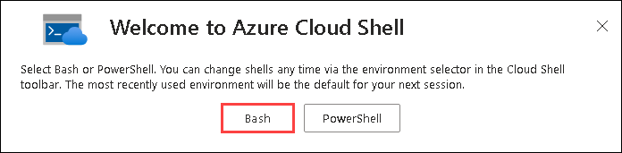
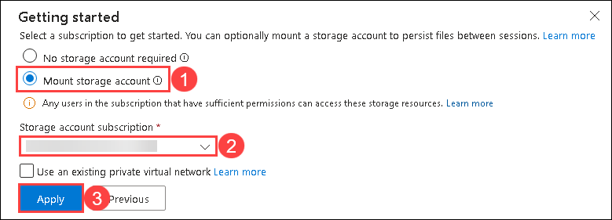
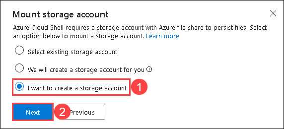
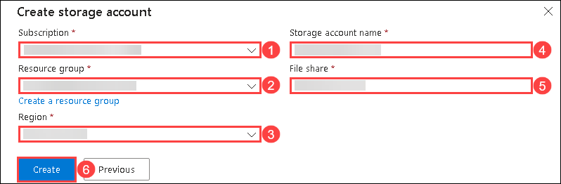

# Infrastructure as Code with Terraform Workshop

Infrastructure as Code (IaC) is a key pillar of modern DevOps. It enables teams to provision and manage cloud resources safely, repeatable, and at scale. This workshop uses **HashiCorp Terraform** with the **AzureRM provider v4.x** to teach IaC fundamentals on Azure.

By the end of this workshop you will understand how to write, validate, and apply Terraform configurations — from a simple VNet all the way to multi-tier deployments built with reusable modules.

---

## Before you start

1. Go to the launch URL provided, sign up, and enter your activation code.
2. Click **Launch Lab** — your lab VM RDP session will open in the browser.

## Login to Azure portal

1. On your virtual machine, click on the **Azure Portal** icon as shown below:

   

1. On the Sign in to Microsoft Azure tab you will see the login screen, in that enter the following email/username and click **Next**.

   - **Email/Username:** <inject key="AzureAdUserEmail"></inject>

     

1. Now enter the following password and click **Sign in**.

   - **Temporary Access Pass:** <inject key="AzureAdUserPassword"></inject>

     

1. If you see the pop-up **Stay Signed in?**, click **Yes**.

   

1. If a Welcome to Microsoft Azure pop-up window appears, simply click **Maybe later** to skip the tour.

### Setting up Cloud Shell

In the lab VM browser:

1. On the **Azure Portal**, from the top navigation bar, click the **Cloud Shell** icon (`>_`).

   

2. Select **Bash**.

   

3. On the CloudShell Bash **Getting started** page, select **Mount storage account (1)**, select your default subscription from the **Storage account subscription (2)** dropdown and click **Apply (3)**.

   

4. On the CloudShell Bash **Mount storage account** page, select **I want to create a storage account (1)** and click **Next (2)**.

   

5. On the CloudShell Bash **Create storage account** page and fill in:
   
   - **Subscription** — select your default subscription (1)
   - **Resource group** — IaC-Terraform-RG-<inject key="Deployment-ID"></inject> (2)
   - **Region** — match the region of your resource group (e.g. **East US**) (3)
   - **Storage account** — blobstorage<inject key="Deployment-ID"></inject> (4)
   - **File share** — fileshare<inject key="Deployment-ID"></inject> (5)
   - Click **Create (6)**

   
   

> **Note:** Use the `IaC-Terraform-RG-<inject key="Deployment-ID"></inject>` resource group for all Azure resources provisioned during the labs.

---

## Workshop Labs

| Lab | Topic | Terraform Guide |
|:----|:------|:---------------:|
| 01 | Basics — providers, resources, and VNet | [Guide](./Terraform/01%20-%20Basics/Guide.md) |
| 02 | Variables — parameterise your configuration | [Guide](./Terraform/02%20-%20Variables/Guide.md) |
| 03 | Helpers — expressions, functions, and dynamic blocks | [Guide](./Terraform/03%20-%20Helpers/Guide.md) |
| 04 | Security — Key Vault, AzureAD, and secrets management | [Guide](./Terraform/04%20-%20Security/Guide.md) |
| 05 | Reusability — local modules | [Guide](./Terraform/05%20-%20Reusability/Guide.md) |

---

## Challenges

After completing the labs, attempt **2 of the 4** open-ended challenges. See [Challenges/Readme.md](./Challenges/Readme.md) for full details and scoring.

---

## Prerequisites

| Tool | Minimum version | Notes |
|:-----|:----------------|:------|
| Terraform | 1.9.x | Available in Azure Cloud Shell by default |
| AzureRM provider | 4.x | Configured in `providers.tf` in each lab |
| Azure CLI | 2.60+ | Available in Azure Cloud Shell by default |

---

[Contribution guide](Contrib.md)
