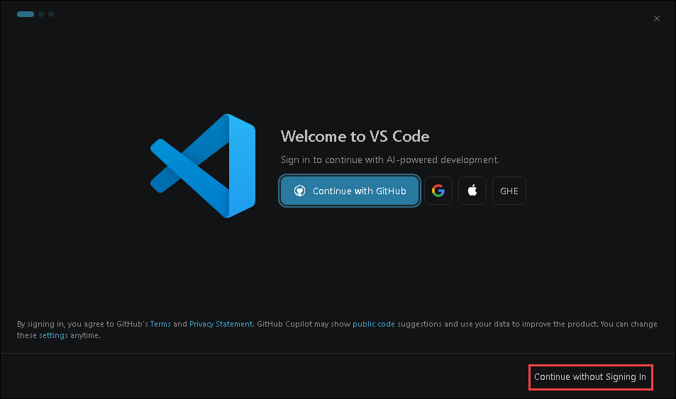
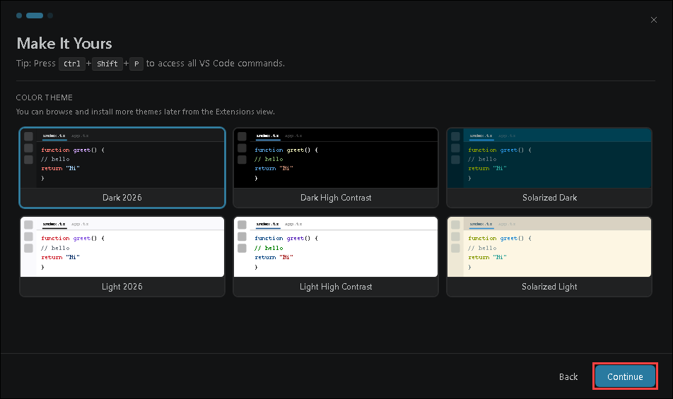
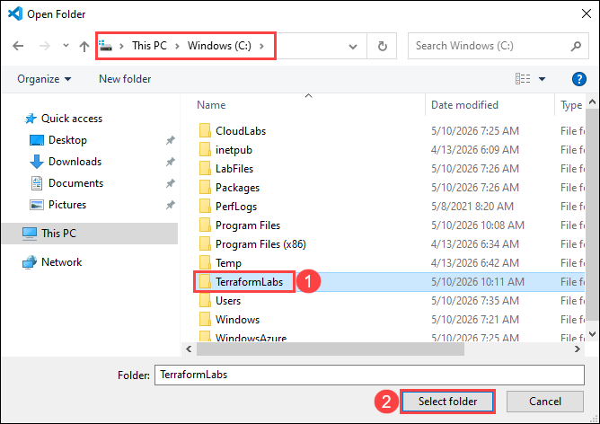
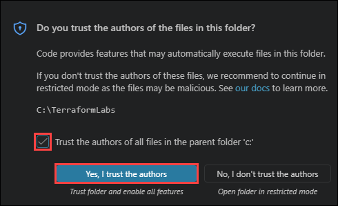
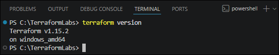
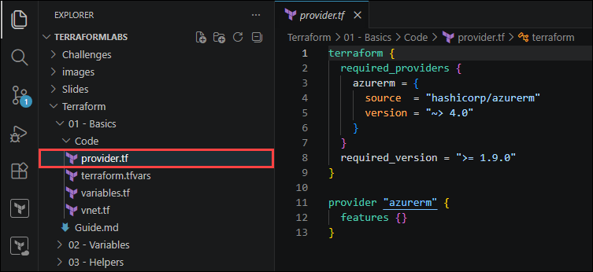
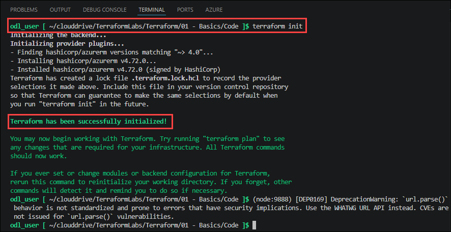
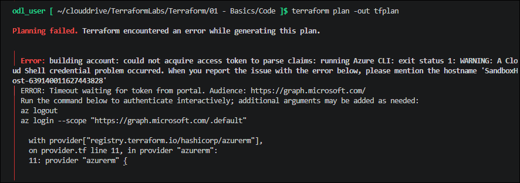

# Lab 01: Terraform Basics — Provision an Azure Virtual Network

### Estimated Duration: 30 Minutes

## Overview

In this lab you will use Terraform to provision the fundamental building block of Azure networking — a Virtual Network (VNet) with a subnet. Azure Virtual Network enables resources such as virtual machines to communicate securely with each other, the internet, and on-premises networks. You will learn the structure of HashiCorp Configuration Language (HCL), configure the AzureRM provider, declare input variables, and run the core Terraform workflow (`init` → `plan` → `apply`).

## Lab Objectives

You will be able to complete the following tasks:

- Task 1: Set up your Terraform environment
- Task 2: Configure the AzureRM provider
- Task 3: Declare input variables
- Task 4: Define the Virtual Network and Subnet
- Task 5: Initialize, plan, and apply the configuration

---

## Task 1: Set up your Terraform environment

In this task you will install the required tools and open the working folder where all Terraform files for this lab will be created.

1. Open **Visual Studio Code** on your Lab-VM.

   

1. Once the IDE opens, if you see a prompt to sign in to GitHub. Click **Continue without signing in** (you will sign in during the upcoming steps).

   

1. When the color theme pop-up appears, select your preferred theme and click **Continue**.

   

1. When the Build with AI Agents pop-up appears, explore the available Copilot agents and features, then click **Get Started**.

   

1. In VS Code, ensure that the following extensions are installed:
   
   - [HashiCorp Terraform](https://marketplace.visualstudio.com/items?itemName=HashiCorp.terraform) — syntax highlighting, validation, and IntelliSense for `.tf` files.
   - [Azure Terraform](https://marketplace.visualstudio.com/items?itemName=ms-azuretools.vscode-azureterraform) — push files to Azure Cloud Shell.
  
   

1. From the **File** menu in VS Code, choose **Open Folder**.

   

1. Select the **C:\TerraformLabs (1)** folder and click **Select folder (2)**.

   

1. Now you will see another screen Do you trust the authors of the files in this folder?. Select the **checkbox (1)** Trust the authors of all files in the parent folder 'C:' and then click **Yes, I trust the authors (2)**.

   

1. Open the integrated terminal **Terminal → New Terminal** and verify Terraform is installed:

   

1. In the integrated terminal, verify Terraform is installed:

   ```bash
   terraform version
   ```

   You should see **Terraform v1.9.x** or later. In this case, **Terraform v1.15.2**.

   

> **Note:** All `terraform` commands in this workshop are run from the **Azure Cloud Shell** (Bash). Use **View → Command Palette → Azure Terraform: Push** to sync your local files to Cloud Shell before running any Terraform command. The first time you do this from a new folder you will be prompted to open the Cloud Shell web application — select **Open** to continue.

---

## Task 2: Configure the AzureRM provider

In this task you create `provider.tf`, which tells Terraform which cloud provider plugin to download and use. The **azurerm** provider is the official HashiCorp plugin for Microsoft Azure.

> **Note:** The `features {}` block is **required** by the AzureRM provider. Provider versions are pinned inside a `required_providers` block within a `terraform` block.

1. In VS Code, open the **Terraform/01 - Basics/Code** folder in the **TerraformLabs** directory.

   

1. Open the `provider.tf` and review the file the contents:

   ```terraform
   terraform {
     required_providers {
       azurerm = {
         source  = "hashicorp/azurerm"
         version = "~> 4.0"
       }
     }
     required_version = ">= 1.9.0"
   }

   provider "azurerm" {
     features {}
   }
   ```

   

   Key points:
   - `required_providers` pins the AzureRM provider version.
   - `required_version` ensures Terraform CLI is at least 1.9.
   - `features {}` is mandatory — always include it even if empty.

---

## Task 3: Declare input variables

In this task you create `variables.tf` and `terraform.tfvars` so that environment-specific values (resource group name and Azure region) are kept separate from resource definitions.

1. Open the **`variables.tf`** and review the file the contents:

   ```terraform
   variable "rg" {
     type        = string
     description = "Name of the resource group to provision resources into."
   }

   variable "location" {
     type        = string
     description = "Azure region where resources will be deployed (e.g. eastus, westeurope)."
   }
   ```

   

1. Open the **`terraform.tfvars`** and update the values:

   ```terraform
   rg       = "IaC-Terraform-RG-<inject key="Deployment-ID"></inject>"    # Replace with your resource group name
   location = "eastus"       # Replace with your Azure region
   ```

   

   > **Note:** `terraform.tfvars` is automatically loaded by Terraform at runtime. Never commit secret values to this file — use environment variables or Azure Key Vault for secrets (covered in Lab 04).

---

## Task 4: Define the Virtual Network and Subnet

In this task you create `vnet.tf`, which defines two resources: an Azure Virtual Network and a Subnet.

**Key VNet concepts:**

| Concept | Description |
|:--------|:------------|
| **Address space** | The private IP CIDR block for the entire VNet (e.g. `10.0.0.0/16`). |
| **Subnet** | A logical subdivision of the VNet's address space. Resources are deployed into subnets. |
| **Region scope** | A VNet lives in a single Azure region. Use VNet Peering to connect VNets across regions. |

1. Open the **`vnet.tf`** and review the file the contents:

   ```terraform
   # Virtual Network
   resource "azurerm_virtual_network" "predayvnet" {
     name                = "tfpreday-vnet-<inject key="Deployment-ID"></inject>"
     location            = var.location
     resource_group_name = var.rg
     address_space       = ["10.0.0.0/16"]
   }

   # Subnet
   resource "azurerm_subnet" "predaysubnet" {
     name                 = "subnet1"
     resource_group_name  = var.rg
     virtual_network_name = azurerm_virtual_network.predayvnet.name
     address_prefixes     = ["10.0.1.0/24"]
   }
   ```

   

   Key points:
   - Subnets are declared as **separate `azurerm_subnet` resources** rather than inline blocks — this makes them independently referenceable.
   - `address_prefixes` accepts a list of CIDR ranges.
   - `azurerm_virtual_network.predayvnet.name` is a Terraform **expression** that creates an implicit dependency — Terraform will always create the VNet before the Subnet.

---

## Task 5: Initialize, plan, and apply the configuration

In this task you run the three core Terraform commands to provision the infrastructure.

1. Push your files to Azure Cloud Shell: **View → Command Palette → Azure Terraform: Push**.

1. In Cloud Shell, navigate to your lab folder (it is synced under `~/clouddrive`):

   ```bash
   cd ~/clouddrive/TerraformLabs/Terraform/01 - Basics/Code
   ```

1. **Initialize** — download the AzureRM provider plugin:

   ```bash
   terraform init
   ```

   You should see: `Terraform has been successfully initialized!`

   

1. **Plan** — preview the changes without deploying:

   ```bash
   terraform plan -out tfplan
   ```

   Expected output:

   ```
   Plan: 2 to add, 0 to change, 0 to destroy.
   ```

   You should see two resources to be created: `azurerm_virtual_network.predayvnet` and `azurerm_subnet.predaysubnet`.

   - If you get access token error while executing the command, follow the below steps and rerun the command:
  
     

     - Log out of Azure CloudShell and log in using Microsoft Graph.
    
       ```
       az logout
       az login 

   

1. **Apply** — deploy the resources to Azure:

   ```bash
   terraform apply tfplan
   ```

   After a short wait you should see:

   ```
   Apply complete! Resources: 2 added, 0 changed, 0 destroyed.
   ```

1. Verify the deployment in the [Azure portal](https://portal.azure.com) by navigating to your resource group — you should see **tfpreday-vnet** with subnet **subnet1**.

> **Note:** Terraform is **idempotent**. If you run `terraform plan` again immediately after a successful apply, it will report `No changes. Infrastructure is up-to-date.`

---

## Summary

In this lab you set up your Terraform environment, configured the AzureRM provider using the modern `required_providers` block, introduced input variables with `variables.tf` and `terraform.tfvars`, defined an Azure Virtual Network and a Subnet using `azurerm_subnet` as a standalone resource, and completed the full `init → plan → apply` Terraform workflow.

### Click **Next >>** to proceed to Lab 02 — Variables.

