# Lab 01: Terraform Basics — Provision an Azure Virtual Network

### Estimated Duration: 30 Minutes

## Overview

In this lab, you will use Terraform to provision the foundational components of Azure networking by creating a Virtual Network (VNet) and subnet. You will configure the AzureRM provider, define reusable input variables, write infrastructure resources using HashiCorp Configuration Language (HCL), and execute the core Terraform workflow: `init` → `plan` → `apply`.

## Lab Objectives

You will be able to complete the following tasks:

- Task 1: Prepare the Terraform Development Environment
- Task 2: Review the AzureRM provider configuration
- Task 3: Define Reusable Terraform Variables
- Task 4: Create the Azure Virtual Network Configuration
- Task 5: Deploy the Infrastructure with Terraform

---

## Task 1: Prepare the Terraform Development Environment

In this task, you will prepare the local development environment required for Terraform deployments in Visual Studio Code, install the required extensions, and verify that Terraform is installed.

1. Open **Visual Studio Code** on your Lab-VM.

   

1. Once the IDE opens, if you see the ***Welcome to VS Code*** sign-in pop-up for GitHub, simply close the window by clicking the **X** in the upper-right corner.

   

1. In VS Code, ensure that the following extensions are installed:
   
   - [HashiCorp Terraform](https://marketplace.visualstudio.com/items?itemName=HashiCorp.terraform) — syntax highlighting, validation, and IntelliSense for `.tf` files.
   - [Microsoft Terraform](https://marketplace.visualstudio.com/items?itemName=ms-azuretools.vscode-azureterraform) — push files to Azure Cloud Shell.
  
   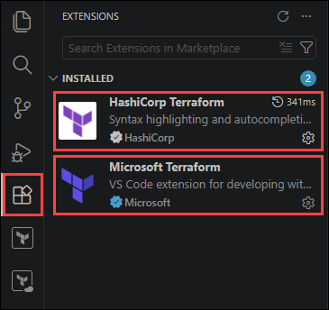

1. From the **File** menu in VS Code, choose **Open Folder**.

   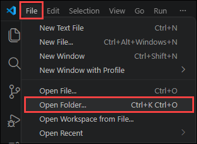

1. Select the **TerraformLabs** folder and click **Select folder**.

   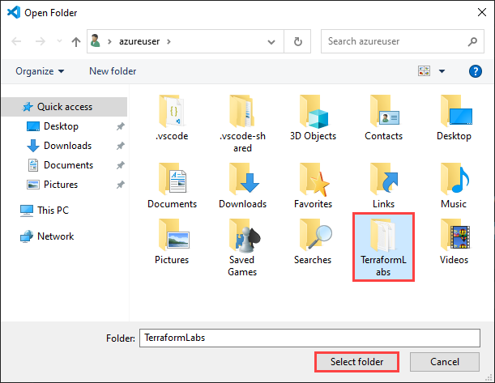

1. Now you will see another screen Do you trust the authors of the files in this folder?. Select the **checkbox (1)** *Trust the authors of all files in the parent folder 'azureuser'* and then click **Yes, I trust the authors (2)**.

   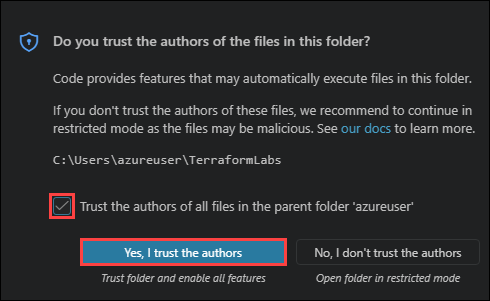

1. Open the integrated terminal by selecting **Terminal → New Terminal**.

   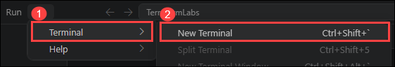

1. In the integrated terminal, verify that Terraform is installed by running the following command:

   ```bash
   terraform version
   ```

   This command displays the currently installed Terraform CLI version. You should see **Terraform version 1.9.x** or later installed in the environment.

   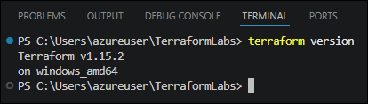

---

## Task 2: Review the AzureRM provider configuration

In this task, you will review the Terraform provider configuration stored in the `provider.tf` file. 

Terraform uses providers as plugins to communicate with cloud platforms and services. The AzureRM provider enables Terraform to create and manage Azure resources.

> **Note:** The `features {}` block is **required** by the AzureRM provider, even when no features are explicitly configured. Provider versions are pinned inside a `required_providers` block within a `terraform` block.

1. In VS Code, open the **Terraform/01 - Basics/Code** folder in the **TerraformLabs** directory.

   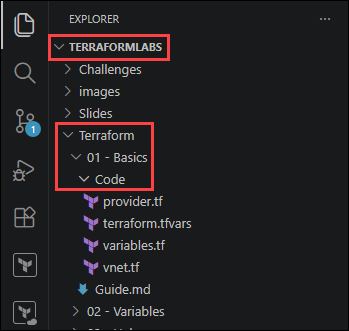

1. Open the `provider.tf` file and review the configuration:

   ```terraform
   terraform {
     required_providers {
       azurerm = {
         source  = "hashicorp/azurerm"
         version = "~> 4.0"
       }
     }
     required_version = ">= 1.9.0"
   }

   provider "azurerm" {
     features {}

     resource_provider_registrations = "none"
   }
   ```

   

   | Configuration | Description |
   |:--------|:-------------|
   | `required_providers` | Specifies the provider source and version Terraform should download |
   | `required_version` | Ensures the environment uses Terraform CLI version 1.9.0 or later |
   | `provider "azurerm"` | Configures the Azure Resource Manager provider |
   | `features {}` | Mandatory block required by the AzureRM provider |
   | `resource_provider_registrations = "none"` | Prevents automatic Azure resource provider registration |

---

## Task 3: Define Reusable Terraform Variables

In this task, you will review how Terraform variables are used to make configurations reusable and environment-independent.

Instead of hardcoding values directly into resource definitions, Terraform variables allow you to separate configuration data from infrastructure logic.

You will define variables in `variables.tf` and assign values using `terraform.tfvars`.

1. Open the **`variables.tf`** file and review the variable declarations:

   ```terraform
   variable "rg" {
     type        = string
     description = "Name of the resource group to provision resources into."
   }

   variable "location" {
     type        = string
     description = "Azure region where resources will be deployed (e.g. eastus, westeurope)."
   }
   ```
   
   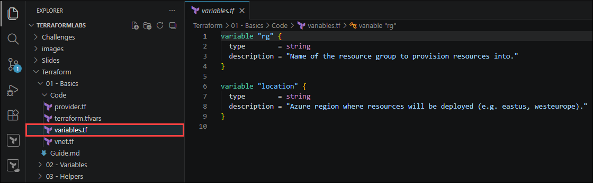

   | Variable | Description |
   |:--------|:-------------|
   | `rg` | Stores the Azure Resource Group name |
   | `location` | Stores the Azure region where resources will be deployed |
   | `type = string` | Defines the variable datatype as text |
   | `description` | Documents the purpose of the variable |

1. Open the **`terraform.tfvars`** file and update the values:

   ```terraform
   rg       = "IaC-Terraform-RG-<inject key="Deployment-ID"></inject>"    # Replace with your resource group name
   location = "<inject key="Region"></inject>"       # Replace with your Azure region
   ```

   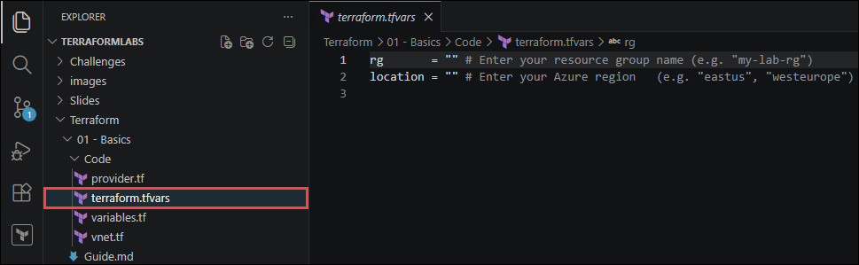

   > **Note:** `terraform.tfvars` is automatically loaded by Terraform at runtime. Never commit secret values to this file — use environment variables or Azure Key Vault for secrets (covered in Lab 04).

---

## Task 4: Create the Azure Virtual Network Configuration

In this task, you will define the Azure Virtual Network and subnet resources in Terraform.

**Azure Networking Concepts:**

| Concept | Description |
|:--------|:------------|
| **Address Space** | The private IP CIDR block for the entire VNet (e.g. `10.0.0.0/16`). |
| **Subnet** | A logical subdivision of the VNet's address space. Resources are deployed into subnets. |
| **Region scope** | VNets exist within a single Azure region. |
| **CIDR Notation** | Specifies IP ranges using slash notation such as `/16` or `/24`. |

1. Open the **`vnet.tf`** and update the file configuration:

   ```terraform
   # Virtual Network
   resource "azurerm_virtual_network" "predayvnet" {
     name                = "tfpreday-vnet-<inject key="Deployment-ID"></inject>"
     location            = var.location
     resource_group_name = var.rg
     address_space       = ["10.0.0.0/16"]
   }

   # Subnet
   resource "azurerm_subnet" "predaysubnet" {
     name                 = "subnet1"
     resource_group_name  = var.rg
     virtual_network_name = azurerm_virtual_network.predayvnet.name
     address_prefixes     = ["10.0.1.0/24"]
   }
   ```

   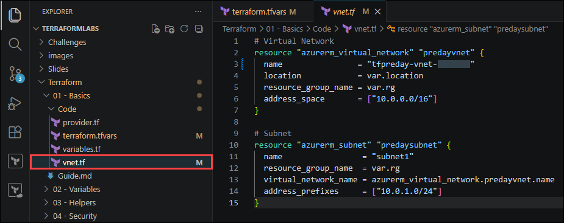

   | Configuration | Description |
   |:--------|:------------|
   | `azurerm_virtual_network` | Creates an Azure Virtual Network |
   | `address_space` | Defines the IP range available to the VNet |
   | `azurerm_subnet` | Creates a subnet inside the VNet |
   | `address_prefixes` | Defines the subnet IP range |
   | `azurerm_virtual_network.predayvnet.name` | Creates an implicit dependency between the subnet and VNet |

---

## Task 5: Deploy the Infrastructure with Terraform

In this task, you will authenticate to Azure and execute the Terraform workflow to deploy the infrastructure.

You will use the following Terraform commands through the labs:

| Configuration | Description |
|:--------|:------------|
| `terraform init` | Downloads provider plugins |
| `terraform plan` | Previews infrastructure changes |
| `terraform apply` | Deploys resources to Azure |

1. Sign in to Azure from the integrated terminal:

   ```
   az login
   ```

   > **Note:** You only need to sign in to Azure once in this lab. Keep using the same integrated terminal session for the upcoming labs so that your Azure authentication remains active.

1. On the *Let’s get you signed in pop-up*, select **Work or school account**, then click **Continue**. You may need to minimize any open applications to bring this window into view.

   

1. You'll see the Sign into Microsoft Azure tab. Here, enter your credentials:

   - **Email/Username:** <inject key="AzureAdUserEmail"></inject>
  
     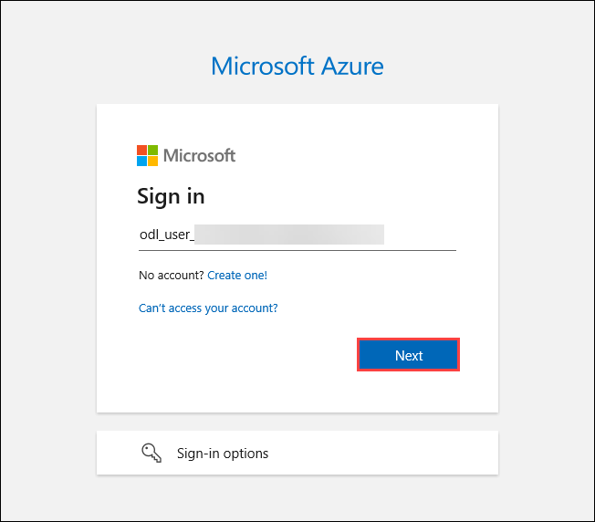
  
1. Next, enter the Temporary Access Pass:

   - **Temporary Access Pass:** <inject key="AzureAdUserPassword"></inject>
  
     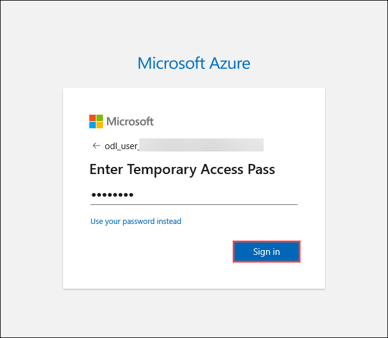

1. On the *Sign in to all apps, websites, and services on this device?*, click **No, this app only**.

   

1. You are now signed in to the Azure portal from your Visual Studio Code terminal. When prompted to select a subscription and tenant, press **Enter** to accept the default selection.

   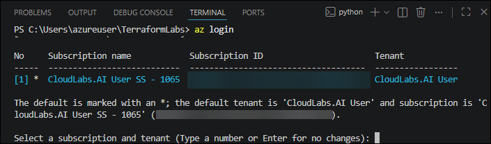

1. Navigate to the `C:\Users\azureuser\TerraformLabs\Terraform\01 - Basics\Code` directory:

   ```
   cd 'C:\Users\azureuser\TerraformLabs\Terraform\01 - Basics\Code'
   ```

1. Initialize the Terraform working directory:

   ```bash
   terraform init
   ```

   You should see: `Terraform has been successfully initialized!`

   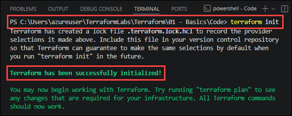

1. Generate an execution plan:

   ```bash
   terraform plan -out tfplan
   ```

   Expected output:

   ```
   Plan: 2 to add, 0 to change, 0 to destroy.
   ```

   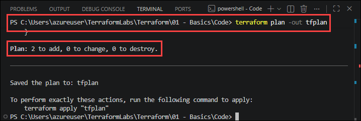

   You should see the following resources listed:
   - `azurerm_virtual_network.predayvnet`
   - `azurerm_subnet.predaysubnet`

1. Apply the Terraform configuration:

   ```bash
   terraform apply tfplan
   ```

   Expected output:

   ```
   Apply complete! Resources: 2 added, 0 changed, 0 destroyed.
   ```

   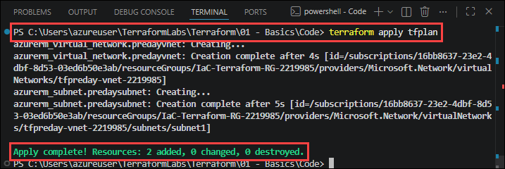

1. Verify the deployment in the [Azure portal](https://portal.azure.com) by navigating to your IaC-Terraform-RG-<inject key="Deployment-ID"></inject> resource group — you should see **tfpreday-vnet-<inject key="Deployment-ID"></inject>** Virtual Network with subnet **subnet1**.

   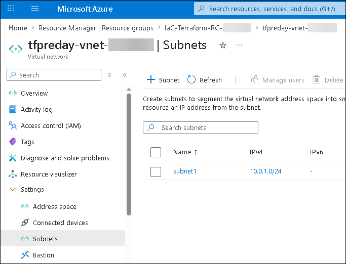

   > **Note:** Terraform is **idempotent**. Running terraform plan again after deployment should return - **No changes. Infrastructure is up-to-date.**

---

## Summary

In this lab, you completed the following:

- Configured the Terraform development environment and Azure provider
- Created reusable Terraform configurations using variables
- Deployed an Azure Virtual Network and subnet using Terraform
- Authenticated Terraform to Azure and executed the `init`, `plan`, and `apply` workflow
- Verified the deployed resources in the Azure portal

