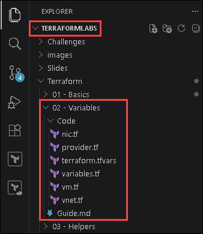
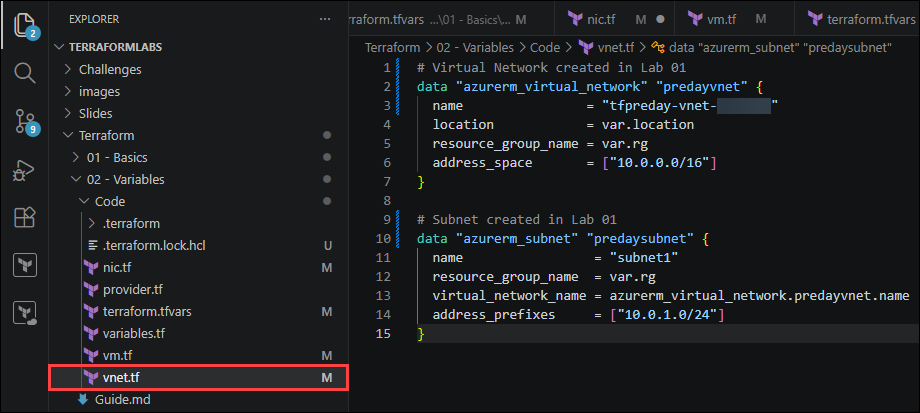
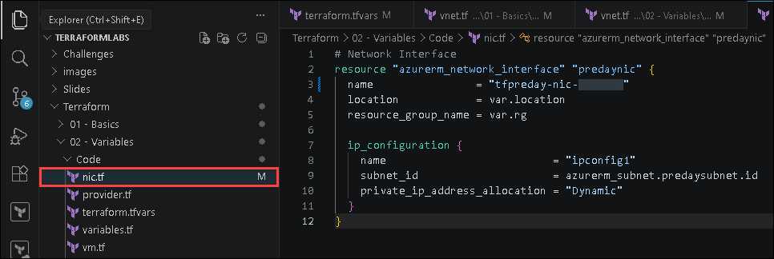
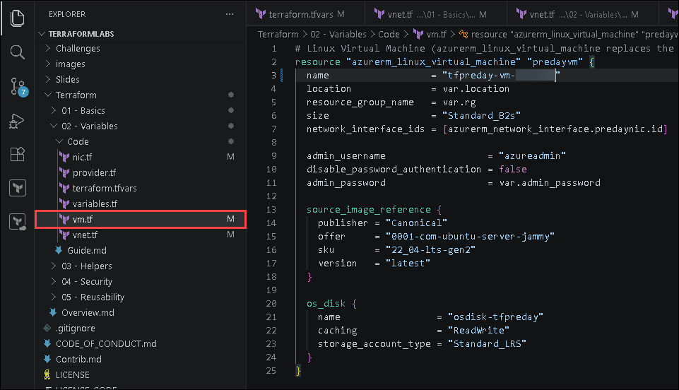
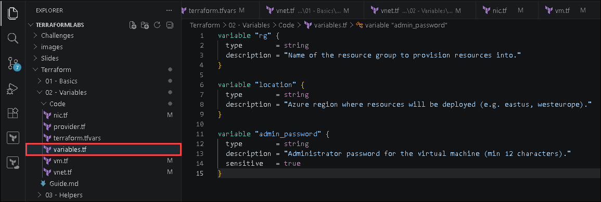
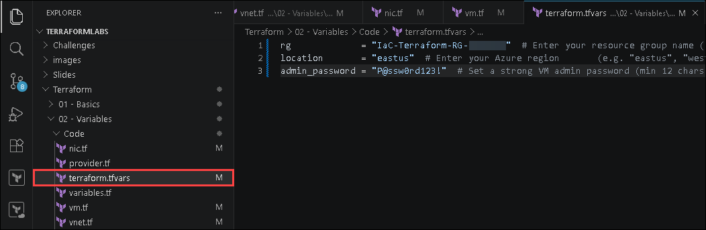
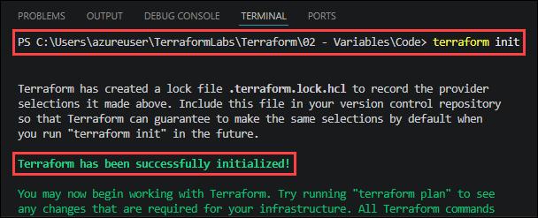
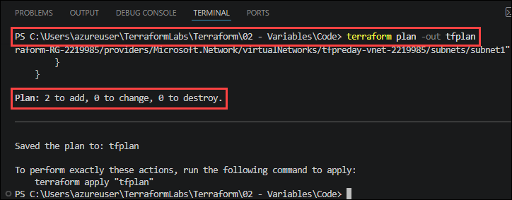
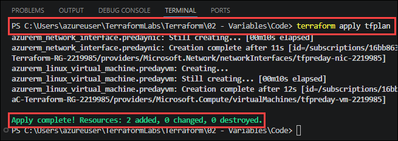
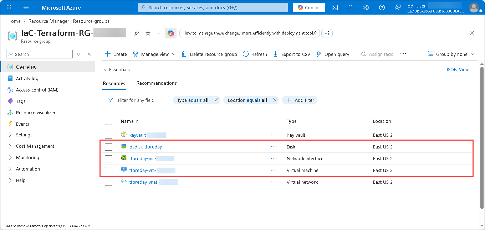

# Lab 02: Terraform Variables - Add a VM with Parameterized Configuration
 
### Estimated Duration: 45 Minutes

## Scenario

Contoso wants infrastructure deployments to become reusable and configurable across environments. In this lab, you will introduce Terraform variables and deploy a Linux Virtual Machine with a Network Interface inside the existing Virtual Network.

## Overview

In this lab, you will extend the infrastructure created in Lab 01 by adding a Network Interface (NIC) and a Linux Virtual Machine (VM). You will use Terraform input variables to parameterize the configuration, reference existing Azure resources using data sources, and understand how Terraform automatically builds resource dependencies through expressions and references.

## Lab Objectives

You will be able to complete the following tasks:

- Task 1: Reference Existing Network Resources
- Task 2: Configure the Virtual Machine Network Interface
- Task 3: Configure the Linux Virtual Machine
- Task 4: Configure Terraform variables
- Task 5: Deploy the Infrastructure with Terraform

---

## Task 1: Reference Existing Network Resources

In this task, you will reference the Virtual Network and subnet that were created in Lab 01. Instead of creating new networking resources, Terraform will use **data sources** to retrieve information about existing Azure resources. Data sources allow Terraform to read infrastructure that already exists without managing or recreating it.

1. In VS Code, open the **Terraform/02 - Variables/Code** folder in the **TerraformLabs** directory.

   

1. Open the `vnet.tf` and update it with the following configuration:

   ```terraform
   # Virtual Network created in Lab 01
   data "azurerm_virtual_network" "predayvnet" {
     name                = "tfpreday-vnet-<inject key="Deployment-ID"></inject>"
     resource_group_name = var.rg
   }

   # Subnet created in Lab 01
   data "azurerm_subnet" "predaysubnet" {
     name                 = "subnet1"
     resource_group_name  = var.rg
     virtual_network_name = data.azurerm_virtual_network.predayvnet.name                   
   }
   ```

   

   | Configuration | Description |
   |:--------|:-------------|
   | `data "azurerm_virtual_network"` | References an existing Azure Virtual Network |
   | `data "azurerm_subnet"` | References an existing subnet inside the Virtual Network |
   | `data.azurerm_virtual_network.predayvnet.name` | Retrieves the name of the referenced Virtual Network |
   | `resource_group_name = var.rg` | Uses the input variable for the Resource Group name |

   > **Note:** Terraform builds a dependency graph automatically using resource and data source references. Explicit `depends_on` statements are not required in this scenario.
   
---

## Task 2: Configure the Virtual Machine Network Interface

In this task, you will create a Network Interface Card (NIC) for the Virtual Machine and attach it to the existing subnet.

Every Azure VM requires at least one NIC to communicate over the network. The NIC connects the VM to a subnet and provides private IP connectivity.

1. Open the **`nic.tf`** and and update the configuration:

   ```terraform
   # Network Interface
   resource "azurerm_network_interface" "predaynic" {
     name                = "tfpreday-nic-<inject key="Deployment-ID"></inject>"
     location            = var.location
     resource_group_name = var.rg

     ip_configuration {
       name                          = "ipconfig1"
       subnet_id                     = data.azurerm_subnet.predaysubnet.id
       private_ip_address_allocation = "Dynamic"
     }
   }
   ```

   

   | Configuration | Description |
   |:--------|:-------------|
   | `azurerm_network_interface` | Creates an Azure Network Interface |
   | `subnet_id` | Associates the NIC with the existing subnet |
   | `private_ip_address_allocation = "Dynamic"` | Automatically assigns a private IP address |
   | `location = var.location` | Uses the deployment region from the variable |
   | `data.azurerm_subnet.predaysubnet.id` | References the subnet resource ID |

   >**Note:** Terraform automatically creates the dependency chain: Virtual Network → Subnet → Network Interface.

---

## Task 3: Configure the Linux Virtual Machine

In this task, you will configure a Linux Virtual Machine and attach the previously created Network Interface.

1. Open the **`vm.tf`** amd and update the configuration:

   ```terraform
   # Linux Virtual Machine
   resource "azurerm_linux_virtual_machine" "predayvm" {
     name                  = "tfpreday-vm-<inject key="Deployment-ID"></inject>"
     location              = var.location
     resource_group_name   = var.rg
     size                  = "Standard_B2s"
     network_interface_ids = [azurerm_network_interface.predaynic.id]

     admin_username                  = "azureadmin"
     disable_password_authentication = false
     admin_password                  = var.admin_password

     source_image_reference {
       publisher = "Canonical"
       offer     = "0001-com-ubuntu-server-jammy"
       sku       = "22_04-lts-gen2"
       version   = "latest"
     }

     os_disk {
       name                 = "osdisk-tfpreday-<inject key="Deployment-ID"></inject>"
       caching              = "ReadWrite"
       storage_account_type = "Standard_LRS"
     }
   }
   ```

   

   | Configuration | Description |
   |:--------|:-------------|
   | `azurerm_linux_virtual_machine` | Creates a Linux Virtual Machine |
   | `network_interface_ids` | Attaches the NIC to the VM |
   | `size = "Standard_B2s"` | Defines the VM SKU and compute size |
   | `admin_password = var.admin_password` | Uses the password value from the variable |
   | `source_image_reference` | Defines the Ubuntu image used for deployment |
   | `os_disk` | Configures the VM operating system disk |

   > **Note:** Avoid hard-coding passwords directly in Terraform configuration files. In Lab 04, you will retrieve secrets securely from Azure Key Vault.

---

## Task 4: Configure Terraform variables

In this task, you will define the required Terraform variables and assign environment-specific values.

1. Open the **`variables.tf`** and ensure the following variables are present:

   ```terraform
   variable "rg" {
     type        = string
     description = "Name of the resource group to provision resources into."
   }

   variable "location" {
     type        = string
     description = "Azure region where resources will be deployed (e.g. eastus, westeurope)."
   }

   variable "admin_password" {
     type        = string
     description = "Administrator password for the virtual machine (min 12 characters)."
     sensitive   = true
   }
   ```

   

   | Configuration | Description |
   |:--------|:-------------|
   | `rg` | Stores the Resource Group name |
   | `location` | Stores the Azure deployment region |
   | `admin_password` | Stores the VM administrator password |
   | `type = string` | Defines the variable datatype |
   | `sensitive = true` | Prevents sensitive values from appearing in Terraform output |

1. Open the **`terraform.tfvars`** and update the values:

   ```terraform
   rg             = "IaC-Terraform-RG-<inject key="Deployment-ID"></inject>"     # Replace with your resource group name
   location       = "<inject key="Region"></inject>"        # Replace with your Azure region
   admin_password = "P@ssw0rd123!"  # Replace with a strong password (≥ 12 chars)
   ```

   

   > **Note:** Add `terraform.tfvars` to `.gitignore` to avoid committing credentials or sensitive values to source control.

---

## Task 5: Deploy the Infrastructure with Terraform

In this task, you will initialize the Terraform working directory, generate an execution plan, and deploy the infrastructure.

1. In the integrated terminal, navigate to the `C:\TerraformLabs\Terraform\02 - Variables\Code` directory:

   ```
   cd 'C:\Users\azureuser\TerraformLabs\Terraform\02 - Variables\Code'
   ```

1. Initialize the Terraform working directory:

   ```bash
   terraform init
   ```

   You should see: `Terraform has been successfully initialized!`

   

1. Generate an execution plan:

   ```bash
   terraform plan -out tfplan
   ```

   Expected output:

   ```
   Plan: 2 to add, 0 to change, 0 to destroy.
   ```

   

   You should see the following resources listed:
   - `azurerm_network_interface`
   - `azurerm_linux_virtual_machine`

1. Apply the Terraform configuration:

   ```bash
   terraform apply tfplan
   ```

   Expected output:

   ```
   Apply complete! Resources: 2 added, 0 changed, 0 destroyed.
   ```

   

1. In the [Azure portal](https://portal.azure.com), navigate to your resource group and confirm VM, OS Disk and NIC resources were created.

   

---

## Summary

In this lab, you completed the following:

- Referenced the existing Azure Virtual Network and subnet using Terraform data sources
- Configured the Virtual Machine Network Interface and Linux Virtual Machine resources
- Configured Terraform variables for reusable and secure deployments
- Deployed the infrastructure using the Terraform `init`, `plan`, and `apply` workflow
- Verified the deployed infrastructure in the Azure portal

---

You have successfully completed the lab. Click **Next >>** in the lower-right corner to proceed to the next lab.


