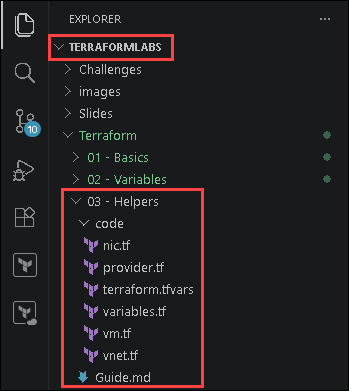
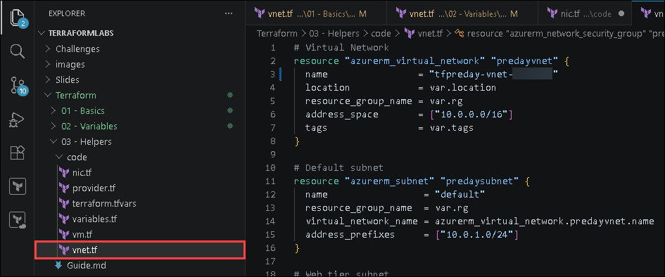
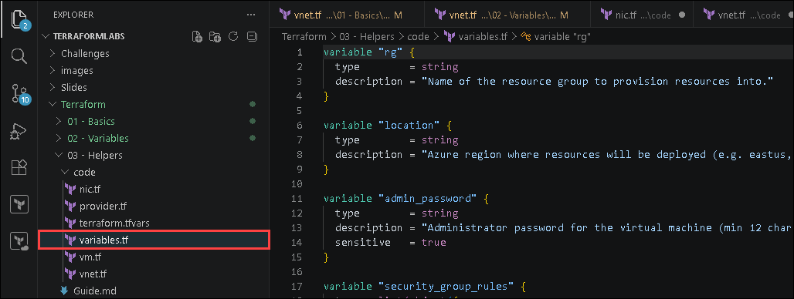
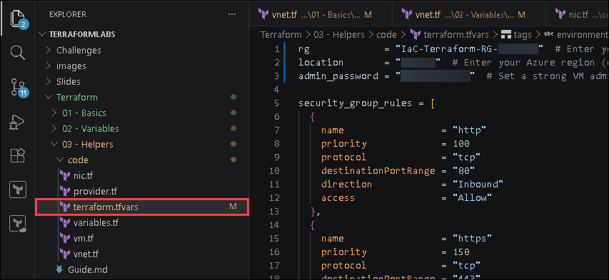
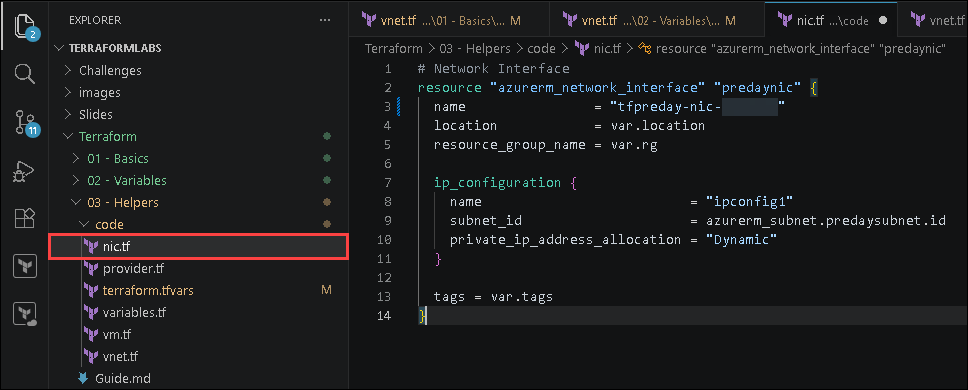
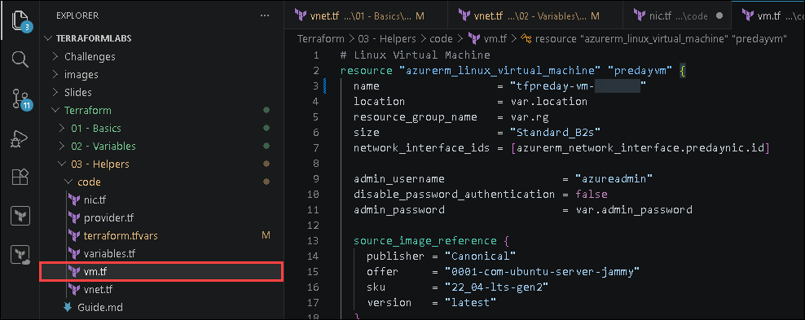
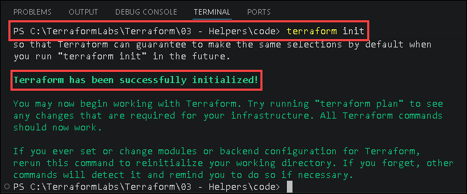
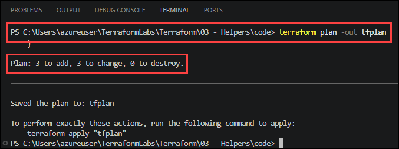

# Lab 03: Helpers & Iterators — Network Security Groups with Dynamic Rules

### Estimated Duration: 45 Minutes

## Overview

In this lab you will extend the infrastructure from Lab 02 by adding a second **web-tier subnet** and securing it with a **Network Security Group (NSG)**. You will learn to use Terraform's `dynamic` block with `for_each` to iterate over a list-of-objects variable and generate N security rules from a single code block, and use built-in HCL string functions (`lower()`, `title()`) to normalize values. You will also add resource **tags** across all resources for governance and cost tracking.

## Lab Objectives

You will be able to complete the following tasks:

- Task 1: Add a web-tier subnet to vnet.tf
- Task 2: Define NSG rules as a list variable
- Task 3: Create the NSG with a `dynamic` block
- Task 4: Associate the NSG with the web subnet
- Task 5: Add tags and update remaining files
- Task 6: Plan and apply

---

## Task 1: Add a web-tier subnet to vnet.tf

In this task you add a second subnet representing the web tier of a typical three-tier architecture.

1. In VS Code, open the **Terraform/03 - Helpers/code** folder in the **TerraformLabs** directory.

   

1. Open the `vnet.tf` and review the file the contents:

   ```terraform
   # Web tier subnet
   resource "azurerm_subnet" "predaywebsubnet" {
     name                 = "web"
     resource_group_name  = var.rg
     virtual_network_name = azurerm_virtual_network.predayvnet.name
     address_prefixes     = ["10.0.2.0/24"]
   }
   ```

   

   > **Note:** NSG associations are managed through the dedicated `azurerm_subnet_network_security_group_association` resource (added in Task 4), not via an attribute on the subnet.

---

## Task 2: Define NSG rules as a list variable

Rather than hard-coding security rules, you will store them as a structured variable so they can be changed without touching the resource definition.

1. Open `variables.tf` and add the following variables (or ensure they are present):

   ```terraform
   variable "admin_password" {
     type        = string
     description = "Administrator password for the virtual machine (min 12 characters)."
     sensitive   = true
   }

   variable "security_group_rules" {
     type = list(object({
       name                 = string
       priority             = number
       protocol             = string
       destinationPortRange = string
       direction            = string
       access               = string
     }))
     description = "List of NSG security rules."
   }

   variable "tags" {
     type        = map(string)
     description = "Tags to apply to all resources."
   }
   ```

   

1. Open `terraform.tfvars` and add the values:

   ```terraform
   rg             = "my-lab-rg"
   location       = "eastus"
   admin_password = "P@ssw0rd123!"

   security_group_rules = [
     {
       name                 = "http"
       priority             = 100
       protocol             = "tcp"
       destinationPortRange = "80"
       direction            = "Inbound"
       access               = "Allow"
     },
     {
       name                 = "https"
       priority             = 150
       protocol             = "tcp"
       destinationPortRange = "443"
       direction            = "Inbound"
       access               = "Allow"
     },
     {
       name                 = "deny-the-rest"
       priority             = 200
       protocol             = "*"
       destinationPortRange = "0-65535"
       direction            = "Inbound"
       access               = "Deny"
     },
   ]

   tags = {
     environment = "lab"
     workshop    = "IaC-with-Terraform"
     year        = "2026"
   }
   ```

   

   NSG rules in Azure are evaluated in **ascending priority order** (lower number = higher priority). The Allow rules for HTTP (100) and HTTPS (150) are evaluated before the Deny-all rule (200).

---

## Task 3: Create the NSG with a `dynamic` block

The `dynamic` block lets you generate repeated nested blocks from a collection. Combined with `for_each`, it replaces copy-pasted rule blocks.

1. In `vnet.tf`, add the following NSG resource:

   ```terraform
   # Network Security Group with dynamic rules
   resource "azurerm_network_security_group" "predaysg" {
     name                = "web-nsg"
     location            = var.location
     resource_group_name = var.rg

     dynamic "security_rule" {
       for_each = var.security_group_rules

       content {
         name                       = lower(security_rule.value.name)
         priority                   = security_rule.value.priority
         direction                  = title(security_rule.value.direction)
         access                     = title(security_rule.value.access)
         protocol                   = title(security_rule.value.protocol)
         source_port_range          = "*"
         destination_port_range     = security_rule.value.destinationPortRange
         source_address_prefix      = "*"
         destination_address_prefix = "VirtualNetwork"
       }
     }
   }
   ```

   Key concepts:
   - `dynamic "security_rule"` tells Terraform to generate one `security_rule` block per element of the collection.
   - `for_each = var.security_group_rules` iterates over the list defined in `terraform.tfvars`.
   - `security_rule.value.name` accesses the `name` field of each element.
   - `lower()` ensures the rule name is always lowercase (e.g. `"HTTP"` → `"http"`).
   - `title()` capitalizes the first letter (e.g. `"inbound"` → `"Inbound"`), matching the value Azure's API expects.

---

## Task 4: Associate the NSG with the web subnet

The NSG is created independently; the association resource links it to the subnet.

1. In `vnet.tf`, add the association resource:

   ```terraform
   # Associate NSG with the web subnet
   resource "azurerm_subnet_network_security_group_association" "preday" {
     subnet_id                 = azurerm_subnet.predaywebsubnet.id
     network_security_group_id = azurerm_network_security_group.predaysg.id
   }
   ```

   Your complete `vnet.tf` should now define: VNet, default subnet, web subnet, NSG, and the NSG association.

---

## Task 5: Add tags and update remaining files

1. Open `nic.tf` and add `tags = var.tags` to the NIC resource.

   

1. Open `vm.tf` and add `tags = var.tags` to the VM resource. Also update the VNet resource in `vnet.tf` to include `tags = var.tags`.

   

1. Confirm `provider.tf` uses the modern `required_providers` block:

   ```terraform
   terraform {
     required_providers {
       azurerm = {
         source  = "hashicorp/azurerm"
         version = "~> 4.0"
       }
     }
     required_version = ">= 1.9.0"
   }

   provider "azurerm" {
     features {}
   }
   ```

---

## Task 6: Plan and apply

1. In the integrated terminal, navigate to the `C:\TerraformLabs\Terraform\03 - Helpers\code` directory:

   ```
   cd 'C:\TerraformLabs\Terraform\03 - Helpers\code'
   ```
   
1. **Initialize** — download the AzureRM provider plugin:

   ```bash
   terraform init
   ```

   You should see: `Terraform has been successfully initialized!`

   

1. Plan:

   ```bash
   terraform plan -out tfplan
   ```

   Expected result:

   ```
   Plan: 3 to add, 1 to change, 0 to destroy.
   ```

   

   The 3 additions are: `predaywebsubnet`, `predaysg` (NSG), and `azurerm_subnet_network_security_group_association`. The 1 change is the VNet gaining tags.

1. Apply:

   ```bash
   terraform apply tfplan
   ```

1. In the [Azure portal](https://portal.azure.com), navigate to your resource group and verify:
   - A new subnet **web** (`10.0.2.0/24`) exists in the VNet.
   - A new NSG **web-nsg** exists with 3 inbound rules: http (Allow 80), https (Allow 443), deny-the-rest (Deny \*).
   - The NSG is associated with the **web** subnet.

---

## Summary

In this lab you added a web-tier subnet, created a Network Security Group with dynamically generated rules using Terraform's `dynamic` block and `for_each`, used the `lower()` and `title()` helper functions for value normalization, and applied resource tags across all infrastructure. You also learned that NSG-to-subnet associations use the dedicated `azurerm_subnet_network_security_group_association` resource.

### Click **Next >>** to proceed to Lab 04 — Security with Azure Key Vault.
