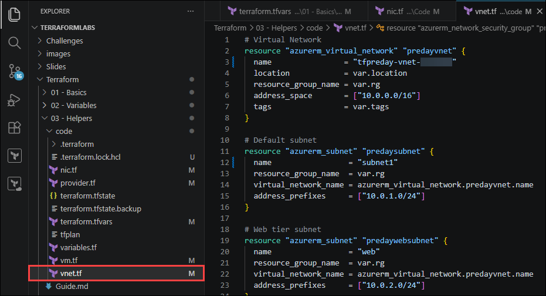
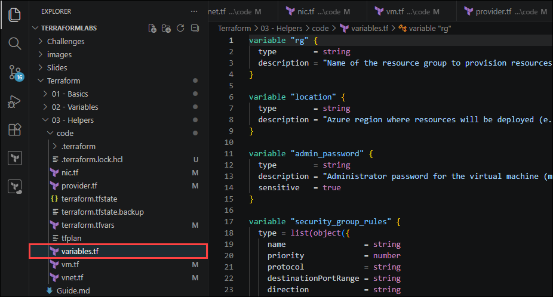
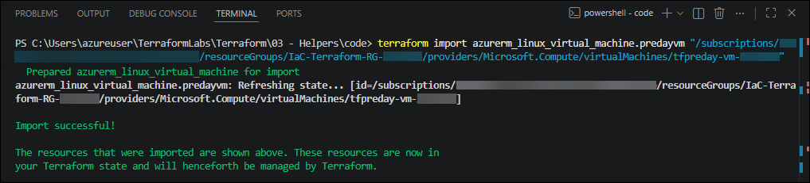
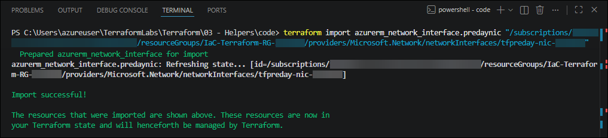
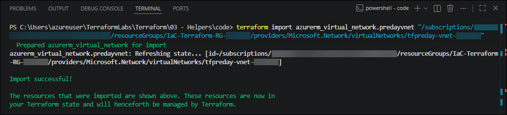
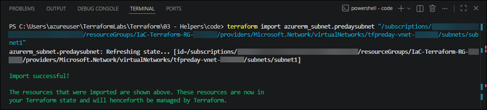
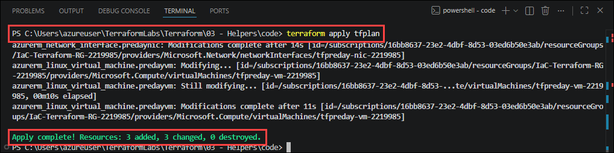
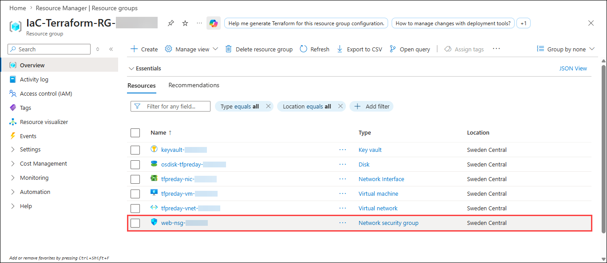
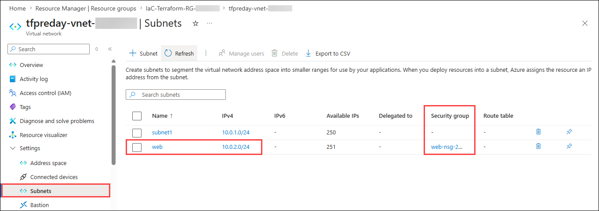

# Lab 03: Helpers & Iterators - Network Security Groups with Dynamic Rules

### Estimated Duration: 45 Minutes

## 📘 Scenario

As Contoso expands its application architecture into multiple tiers, the infrastructure must include network security controls. In this lab, you will create a web-tier subnet, configure a Network Security Group (NSG) with dynamic rules using iterators, and apply standardized resource tags.

## 📖 Overview

In this lab you will extend the infrastructure from Lab 02 by adding a second **web-tier** subnet and securing it with a **Network Security Group (NSG)**. You will use Terraform `dynamic` blocks with `for_each` to generate multiple NSG rules from a single reusable configuration and apply resource tags for governance and cost tracking.

## 🎯 Objectives

You will be able to complete the following tasks:

- Task 1: Extend the Network Architecture
- Task 2: Update the Virtual Machine Network Interface
- Task 3: Apply Tags to the Virtual Machine Configuration
- Task 4: Configure Dynamic Security Rules and Tags
- Task 5: Import Existing Resources and Deploy Changes

---

## Task 1: Extend the Network Architecture

In this task you will add a dedicated web-tier subnet, create a Network Security Group (NSG) with dynamically generated security rules, and associate the NSG with the web subnet.

1. In VS Code, open the **Terraform/03 - Helpers/code** folder in the **TerraformLabs** directory.

   

1. Open the **`vnet.tf`** and update it with the following configuration:

   ```terraform
   # Virtual Network
   resource "azurerm_virtual_network" "predayvnet" {
     name                = "tfpreday-vnet-<inject key="Deployment-ID"></inject>"
     location            = var.location
     resource_group_name = var.rg
     address_space       = ["10.0.0.0/16"]
     tags                = var.tags
   }

   # Default subnet
   resource "azurerm_subnet" "predaysubnet" {
     name                 = "subnet1"
     resource_group_name  = var.rg
     virtual_network_name = azurerm_virtual_network.predayvnet.name
     address_prefixes     = ["10.0.1.0/24"]
   }

   # Web tier subnet
   resource "azurerm_subnet" "predaywebsubnet" {
     name                 = "web"
     resource_group_name  = var.rg
     virtual_network_name = azurerm_virtual_network.predayvnet.name
     address_prefixes     = ["10.0.2.0/24"]
   }

   # Network Security Group with dynamic rules
   resource "azurerm_network_security_group" "predaysg" {
     name                = "web-nsg-<inject key="Deployment-ID"></inject>"
     location            = var.location
     resource_group_name = var.rg

     dynamic "security_rule" {
       for_each = var.security_group_rules

       content {
         name                       = lower(security_rule.value.name)
         priority                   = security_rule.value.priority
         direction                  = title(security_rule.value.direction)
         access                     = title(security_rule.value.access)
         protocol                   = title(security_rule.value.protocol)
         source_port_range          = "*"
         destination_port_range     = security_rule.value.destinationPortRange
         source_address_prefix      = "*"
         destination_address_prefix = "VirtualNetwork"
       }
     }
   }

   # Associate NSG with the web subnet (replaces deprecated network_security_group_id on subnet)
   resource "azurerm_subnet_network_security_group_association" "preday" {
     subnet_id                 = azurerm_subnet.predaywebsubnet.id
     network_security_group_id = azurerm_network_security_group.predaysg.id
   }
   ```

   

   | Configuration | Description |
   |:--------|:-------------|
   | `azurerm_virtual_network` | Creates the Azure Virtual Network and applies tags using `var.tags` |
   | `azurerm_subnet.predaysubnet` | Creates the default subnet used by the VM workload |
   | `azurerm_subnet.predaywebsubnet` | Creates a second subnet representing the web tier |
   | `dynamic "security_rule"` | Dynamically generates one NSG rule block for each object in the input collection |
   | `for_each = var.security_group_rules` | Iterates through the NSG rule objects defined in `terraform.tfvars` |
   | `security_rule.value.<property>` | Accesses properties from the current object during iteration |
   | `lower()` | Converts values such as `"HTTP"` to lowercase (`"http"`) |
   | `title()` | Converts values such as `"inbound"` to title case (`"Inbound"`) |
   | `azurerm_subnet_network_security_group_association` | Associates the NSG with the web subnet using a dedicated resource. |

   > 📌 **Note:** NSG associations are managed using the `azurerm_subnet_network_security_group_association` resource instead of the deprecated `network_security_group_id` attribute on the subnet resource.

---

## Task 2: Update the Virtual Machine Network Interface

In this task you will update the Network Interface configuration and apply tags to the resource.

1. Open the **`nic.tf`** and and update the configuration:

   ```
   # Network Interface
   resource "azurerm_network_interface" "predaynic" {
     name                = "tfpreday-nic-<inject key="Deployment-ID"></inject>"
     location            = var.location
     resource_group_name = var.rg

     ip_configuration {
       name                          = "ipconfig1"
       subnet_id                     = azurerm_subnet.predaysubnet.id
       private_ip_address_allocation = "Dynamic"
     }

     tags = var.tags
   }
   ```

   

   | Configuration | Description |
   |:--------|:-------------|
   | `subnet_id` | Connects the NIC to the default subnet |
   | `private_ip_address_allocation = "Dynamic"` | Configures Azure to dynamically assign a private IP address |
   | `tags = var.tags` | Applies standardized tags to the NIC resource |

---

## Task 3: Apply Tags to the Virtual Machine Configuration

In this task you will update the Virtual Machine configuration and apply resource tags.

1. Open the **`vm.tf`** and update the configuration:

   ```
   # Linux Virtual Machine
   resource "azurerm_linux_virtual_machine" "predayvm" {
     name                  = "tfpreday-vm-<inject key="Deployment-ID"></inject>"
     location              = var.location
     resource_group_name   = var.rg
     size                  = "Standard_B2s"
     network_interface_ids = [azurerm_network_interface.predaynic.id]

     admin_username                  = "azureadmin"
     disable_password_authentication = false
     admin_password                  = var.admin_password

     source_image_reference {
       publisher = "Canonical"
       offer     = "0001-com-ubuntu-server-jammy"
       sku       = "22_04-lts-gen2"
       version   = "latest"
     }

     os_disk {
       name                 = "osdisk-tfpreday-<inject key="Deployment-ID"></inject>"
       caching              = "ReadWrite"
       storage_account_type = "Standard_LRS"
     }

     tags = var.tags
   }
   ```

   

   | Configuration | Description |
   |:--------|:-------------|
   | `network_interface_ids` | Attaches the VM to the previously created NIC |
   | `admin_password = var.admin_password` | Retrieves the VM password from an input variable instead of hard-coding it |
   | `source_image_reference` | Defines the Ubuntu 22.04 LTS marketplace image |
   | `tags = var.tags` | Applies governance and cost-tracking tags to the VM |

---

## Task 4: Configure Dynamic Security Rules and Tags

In this task, you will define structured Terraform variables for NSG rules and tags.

1. Open the **`variables.tf`** and and ensure it contains the following variables:

   ```terraform
   variable "rg" {
     type        = string
     description = "Name of the resource group to provision resources into."
   }

   variable "location" {
     type        = string
     description = "Azure region where resources will be deployed (e.g. eastus, westeurope)."
   }

   variable "admin_password" {
     type        = string
     description = "Administrator password for the virtual machine (min 12 characters)."
     sensitive   = true
   }

   variable "security_group_rules" {
     type = list(object({
       name                 = string
       priority             = number
       protocol             = string
       destinationPortRange = string
       direction            = string
       access               = string
     }))
     description = "List of NSG security rules."
   }

   variable "tags" {
     type        = map(string)
     description = "Tags to apply to all resources."
   }
   ```

   

   | Configuration | Description |
   |:--------|:-------------|
   | `rg` | Defines the target Azure Resource Group name |
   | `location` | Specifies the Azure deployment region |
   | `admin_password` | Stores the VM administrator password securely |
   | `security_group_rules` | Defines a reusable list of NSG rule objects |
   | `tags` | Stores reusable tags applied across all resources |

1. Open the **`terraform.tfvars`** and and add the following values:

   ```terraform
   rg             = "IaC-Terraform-RG-<inject key="Deployment-ID"></inject>"
   location       = "<inject key="Region"></inject>"
   admin_password = "P@ssw0rd123!"

   security_group_rules = [
     {
       name                 = "http"
       priority             = 100
       protocol             = "tcp"
       destinationPortRange = "80"
       direction            = "Inbound"
       access               = "Allow"
     },
     {
       name                 = "https"
       priority             = 150
       protocol             = "tcp"
       destinationPortRange = "443"
       direction            = "Inbound"
       access               = "Allow"
     },
     {
       name                 = "deny-the-rest"
       priority             = 200
       protocol             = "*"
       destinationPortRange = "0-65535"
       direction            = "Inbound"
       access               = "Deny"
     },
   ]

   tags = {
     environment = "lab"
     workshop    = "IaC-with-Terraform"
     year        = "2026"
   }
   ```

   

   | Configuration | Description |
   |:--------|:-------------|
   | `http` | Allows inbound HTTP traffic on port 80 |
   | `https` | Allows inbound HTTPS traffic on port 443 |
   | `deny-the-rest` | Denies all remaining inbound traffic |

   > 📌 **Note:** Azure evaluates NSG rules in ascending priority order. Lower priority numbers are processed first.

---

## Task 5: Import Existing Resources and Deploy Changes

In this task, you will import existing Azure resources into the Terraform state file, allowing Terraform to manage the infrastructure and apply future configuration changes safely.

> ⚠️ **Important:** A resource must be present in the Terraform state before Terraform can track, update, or manage it reliably.

1. In the integrated terminal, navigate to the `C:\Users\azureuser\TerraformLabs\Terraform\03 - Helpers\code` directory:

   ```
   cd 'C:\Users\azureuser\TerraformLabs\Terraform\03 - Helpers\code'
   ```
   
1. Initialize the Terraform working directory:

   ```bash
   terraform init
   ```

   You should see: `Terraform has been successfully initialized!`

   

1. Import the existing Virtual Machine resource into Terraform state:

   ```
   terraform import azurerm_linux_virtual_machine.predayvm "/subscriptions/<inject key="AzureSubscriptionID"></inject>/resourceGroups/IaC-Terraform-RG-<inject key="Deployment-ID"></inject>/providers/Microsoft.Compute/virtualMachines/tfpreday-vm-<inject key="Deployment-ID"></inject>"
   ```

   

1. Import the existing Network Interface resource into Terraform state:

   ```
   terraform import azurerm_network_interface.predaynic "/subscriptions/<inject key="AzureSubscriptionID"></inject>/resourceGroups/IaC-Terraform-RG-<inject key="Deployment-ID"></inject>/providers/Microsoft.Network/networkInterfaces/tfpreday-nic-<inject key="Deployment-ID"></inject>"
   ```

   

1. Import the existing Virtual Network resource into Terraform state:

   ```
   terraform import azurerm_virtual_network.predayvnet "/subscriptions/<inject key="AzureSubscriptionID"></inject>/resourceGroups/IaC-Terraform-RG-<inject key="Deployment-ID"></inject>/providers/Microsoft.Network/virtualNetworks/tfpreday-vnet-<inject key="Deployment-ID"></inject>"
   ```

   

1. Import the existing subnet resource into Terraform state:

   ```
   terraform import azurerm_subnet.predaysubnet "/subscriptions/<inject key="AzureSubscriptionID"></inject>/resourceGroups/IaC-Terraform-RG-<inject key="Deployment-ID"></inject>/providers/Microsoft.Network/virtualNetworks/tfpreday-vnet-<inject key="Deployment-ID"></inject>/subnets/subnet1"
   ```

   

1. Generate an execution plan:

   ```bash
   terraform plan -out tfplan
   ```

   Expected output:

   ```
   Plan: 3 to add, 3 to change, 0 to destroy.
   ```

   

   You should see the following resources in the execution plan:
   - `azurerm_subnet.predaywebsubnet`
   - `azurerm_network_security_group.predaysg`
   - `azurerm_subnet_network_security_group_association.preday`
   - `azurerm_virtual_network.predayvnet`, `azurerm_network_interface.predaynic` and `azurerm_linux_virtual_machine.predayvm` (updated with tags)

1. Apply the Terraform configuration:

   ```bash
   terraform apply tfplan
   ```

   

1. In the Azure portal, navigate to your **IaC-Terraform-RG-<inject key="Deployment-ID" enableCopy="false"></inject>** resource group and verify:
   
   - A new subnet **web** (`10.0.2.0/24`) exists in the VNet.
   - A new NSG **web-nsg-<inject key="Deployment-ID" enableCopy="false"></inject>** exists with 3 inbound rules: http (Allow 80), https (Allow 443), deny-the-rest (Deny \*).
   - The NSG is associated with the **web** subnet.

   

   
   
---

## 🧾 Summary

In this lab, you completed the following:

- Extended the existing network architecture with a web-tier subnet
- Updated the Virtual Machine Network Interface configuration
- Applied reusable tags to the Virtual Machine configuration
- Configured dynamic Network Security Group rules using dynamic blocks and for_each
- Imported existing Azure resources into Terraform state and deployed infrastructure changes safely

---

You have successfully completed the lab. Click **Next >>** in the lower-right corner to proceed to the next lab.


