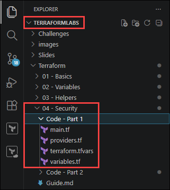
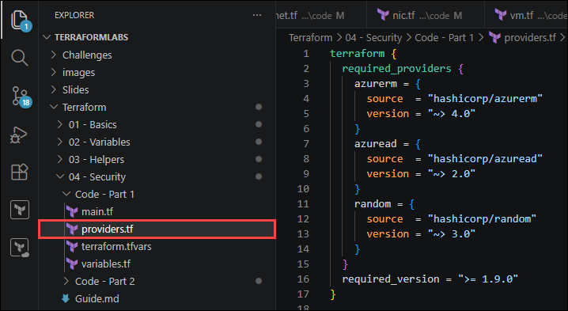
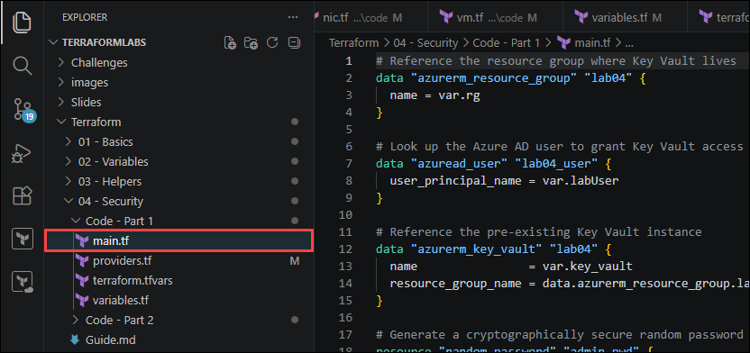
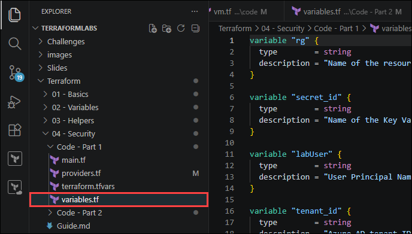
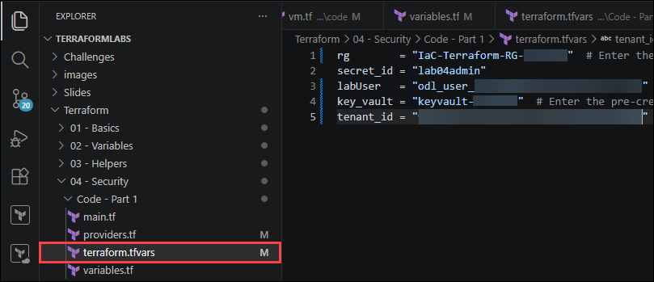
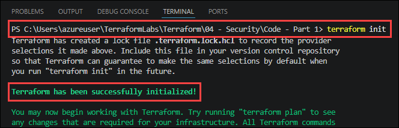
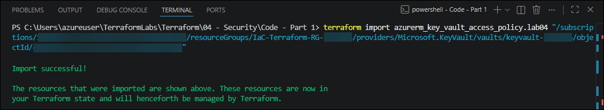
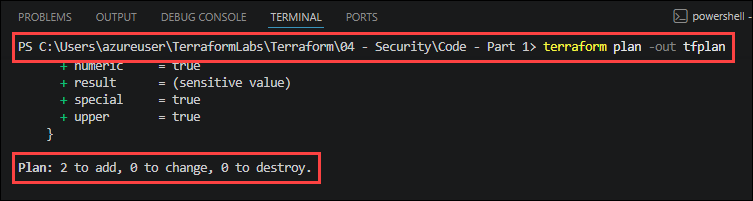
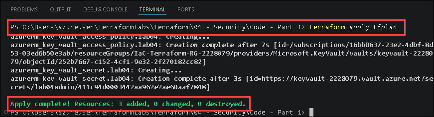

# Lab 04: Security — Secrets Management with Azure Key Vault

### Estimated Duration: 60 Minutes

## Overview

In any real-world Infrastructure as Code project you will have secrets — passwords, connection strings, certificates, and API keys — that resources require at provisioning time. **Secrets must never appear in plain text in code or state files.** In this lab you will use [Azure Key Vault](https://learn.microsoft.com/azure/key-vault/general/overview) as a central secret store.

The lab has two parts:

- **Part 1** — Generate a random password and store it as a Key Vault secret using the `azuread`, `azurerm`, and `random` providers.
- **Part 2** — Read the secret back from Key Vault as a data source and use its value as the VM admin password, so it never appears in code.

## Lab Objectives

You will be able to complete the following tasks:

- Task 1: Configure multi-provider setup (Part 1)
- Task 2: Grant Key Vault access and store a secret
- Task 3: Plan and apply Part 1
- Task 4: Reference the Key Vault secret in vm.tf (Part 2)
- Task 5: Plan and apply Part 2

---

## Part 1 — Store a Secret in Azure Key Vault

### Task 1: Configure multi-provider setup

In this task you create a new working folder for Part 1 and configure three providers.

1. In VS Code, open the **Terraform/02 - Variables/Code - Part 1** folder in the **TerraformLabs** directory.

   

1. Open **`providers.tf`** and ensure the code is similar:

   ```terraform
   terraform {
     required_providers {
       azurerm = {
         source  = "hashicorp/azurerm"
         version = "~> 4.0"
       }
       azuread = {
         source  = "hashicorp/azuread"
         version = "~> 2.0"
       }
       random = {
         source  = "hashicorp/random"
         version = "~> 3.0"
       }
     }
     required_version = ">= 1.9.0"
   }

   provider "azurerm" {
     features {}

     resource_provider_registrations = "none"
   }

   provider "azuread" {}

   provider "random" {}
   ```

   

   Provider summary:

   | Provider | Purpose |
   |:---------|:--------|
   | `azurerm` | Azure infrastructure (Key Vault access policy, secret) |
   | `azuread` | Look up Azure AD user object ID for Key Vault permissions |
   | `random` | Generate a cryptographically secure password |

---

### Task 2: Grant Key Vault access and store a secret

In this task you write `main.tf` to read the existing Key Vault, generate a password, and store it as a secret.

1. Open **`main.tf`** and ensure that the code is similar:

   ```terraform
   # Reference the resource group where Key Vault lives
   data "azurerm_resource_group" "lab04" {
     name = var.rg
   }

   # Look up the Azure AD user so we can grant Key Vault access
   data "azuread_user" "lab04_user" {
     user_principal_name = var.labUser
   }

   # Reference the pre-existing Key Vault instance
   data "azurerm_key_vault" "lab04" {
     name                = var.key_vault
     resource_group_name = data.azurerm_resource_group.lab04.name
   }

   # Generate a cryptographically secure random password (24 chars with special chars)
   resource "random_password" "admin_pwd" {
     length  = 24
     special = true
   }

   # Grant the lab user permission to List/Get/Set/Delete secrets
   resource "azurerm_key_vault_access_policy" "lab04" {
     key_vault_id = data.azurerm_key_vault.lab04.id

     tenant_id = var.tenant_id
     object_id = data.azuread_user.lab04_user.object_id

     secret_permissions = [
       "List", "Get", "Delete", "Set"
     ]
   }

   # Store the generated password as a Key Vault secret
   resource "azurerm_key_vault_secret" "lab04" {
     name         = var.secret_id
     value        = random_password.admin_pwd.result
     key_vault_id = data.azurerm_key_vault.lab04.id

     depends_on = [azurerm_key_vault_access_policy.lab04]
   }
   ```

   

   Key points:
   - `data.azuread_user.lab04_user.object_id` references the user's unique ID in Entra ID.
   - `secret_permissions` values are **title-cased** (`"Get"`, `"Set"`, etc.).
   - `random_password` (not `random_string`) ensures the result is marked sensitive and never printed in logs.
   - `depends_on` ensures the access policy exists before the secret is written.

1. Open **`variables.tf`** and ensure the code is similar:

   ```terraform
   variable "rg" {
     type        = string
     description = "Name of the resource group where Key Vault is located."
   }

   variable "secret_id" {
     type        = string
     description = "Name of the Key Vault secret to store the VM admin password."
   }

   variable "labUser" {
     type        = string
     description = "User Principal Name (UPN) of the lab user (e.g. user@domain.com)."
   }

   variable "tenant_id" {
     type        = string
     description = "Azure AD tenant ID."
   }

   variable "key_vault" {
     type        = string
     description = "Name of the pre-existing Azure Key Vault instance."
   }
   ```

   

1. Add your values to **`terraform.tfvars`**:

   ```terraform
   rg        = "IaC-Terraform-RG-<inject key="Deployment-ID"></inject>"           # Enter the resource group name where Key Vault is located
   secret_id = "lab04admin"
   labUser   = "<inject key="AzureAdUserEmail"></inject>"           # Enter your Azure AD UPN (e.g. user@contoso.com)
   key_vault = "keyvault-<inject key="Deployment-ID"></inject>"           # Enter the pre-created Key Vault name
   tenant_id = "<inject key="TenantID"></inject>"           # Run: az account show --query tenantId -o tsv
   ```

   

   > **Note:** To get your tenant ID, run `az account show --query tenantId -o tsv` in Azure Cloud Shell.

---

### Task 3: Plan and apply Part 1

1. In the integrated terminal, navigate to the `C:\Users\azureuser\TerraformLabs\Terraform\04 - Security\Code - Part 1` directory:

   ```
   cd 'C:\Users\azureuser\TerraformLabs\Terraform\04 - Security\Code - Part 1'
   ```

1. **Initialize** — download the AzureRM provider plugin:

   ```bash
   terraform init
   ```

   You should see: `Terraform has been successfully initialized!`

   

1. Import the keyvault:

   ```
   terraform import azurerm_key_vault_access_policy.lab04 "/subscriptions/<inject key="AzureSubsciptionID"></inject>/resourceGroups/IaC-Terraform-RG-<inject key="Deployment-ID"></inject>/providers/Microsoft.KeyVault/vaults/keyvault-<inject key="Deployment-ID"></inject>/objectId/<inject key="AzureAdUserObjectID"></inject>"
   ```

   

1. **Plan** — preview the changes without deploying:

   ```bash
   terraform plan -out tfplan
   ```

   Expected result:

   ```
   Plan: 2 to add, 0 to change, 0 to destroy.
   ```

   

   (The `azurerm_key_vault_access_policy` and `azurerm_key_vault_secret`.)

1. Apply:

   ```bash
   terraform apply tfplan
   ```

   

1. Verify in the [Azure portal](https://portal.azure.com): navigate to your Key Vault → **Secrets** → confirm that **lab04admin** has been created.

---

## Part 2 — Reference the Secret from Infrastructure

### Task 4: Reference the Key Vault secret in vm.tf

In this task you update the VM configuration from Lab 03 so that the admin password is read from Key Vault at plan/apply time — it never appears in your `.tf` files or `terraform.tfvars`.

1. In your Lab 04 Part 2 working folder, open **`vm.tf`** and ensure it contains the following:

   ```terraform
   # Reference the Key Vault instance from Part 1
   data "azurerm_key_vault" "tf_preday" {
     name                = var.key_vault
     resource_group_name = var.rg2
   }

   # Read the secret stored in Part 1
   data "azurerm_key_vault_secret" "tf_preday" {
     name         = var.secret_id
     key_vault_id = data.azurerm_key_vault.tf_preday.id
   }

   # Linux Virtual Machine — password sourced from Key Vault, never in code
   resource "azurerm_linux_virtual_machine" "predayvm" {
     name                  = "tfpreday-vm"
     location              = var.location
     resource_group_name   = var.rg
     size                  = "Standard_B2s"
     network_interface_ids = [azurerm_network_interface.predaynic.id]

     admin_username                  = "azureadmin"
     disable_password_authentication = false
     admin_password                  = data.azurerm_key_vault_secret.tf_preday.value

     source_image_reference {
       publisher = "Canonical"
       offer     = "0001-com-ubuntu-server-jammy"
       sku       = "22_04-lts-gen2"
       version   = "latest"
     }

     os_disk {
       name                 = "osdisk-tfpreday"
       caching              = "ReadWrite"
       storage_account_type = "Standard_LRS"
     }

     tags = var.tags
   }
   ```

   The critical line: `admin_password = data.azurerm_key_vault_secret.tf_preday.value` — Terraform reads the secret value at runtime. Your code contains only a **reference**, not the actual password.

1. Ensure `variables.tf` includes the new variables `secret_id`, `key_vault`, and `rg2`:

   ```terraform
   variable "secret_id" {
     type        = string
     description = "Name of the Key Vault secret containing the VM admin password."
   }

   variable "key_vault" {
     type        = string
     description = "Name of the pre-existing Azure Key Vault instance."
   }

   variable "rg2" {
     type        = string
     description = "Name of the resource group where Key Vault exists."
   }
   ```

1. Update `terraform.tfvars` with the Key Vault values:

   ```terraform
   secret_id = "lab04admin"
   key_vault = ""  # Enter the pre-created Key Vault name
   rg2       = ""  # Enter the resource group where Key Vault exists
   ```

---

### Task 5: Plan and apply Part 2

1. Push files to Cloud Shell and plan:

   ```bash
   terraform plan -out tfplan
   ```

   Expected result:

   ```
   Plan: 5 to add, 0 to change, 0 to destroy.
   ```

1. Apply:

   ```bash
   terraform apply tfplan
   ```

1. Confirm in the Azure portal that the VM was created. Note that nowhere in your code or `tfvars` is the actual password visible.

   > **Note:** The password is still stored in the Terraform state file (`terraform.tfstate`). Always store state remotely in an encrypted backend such as **Azure Blob Storage** with soft-delete enabled. See [Store Terraform state in Azure Storage](https://learn.microsoft.com/azure/developer/terraform/store-state-in-azure-storage) for setup instructions.

---

## Summary

In this lab you implemented secrets management best practices for Terraform on Azure. In Part 1 you used three providers (`azurerm`, `azuread`, `random`) to generate a cryptographically secure password and store it in Azure Key Vault. In Part 2 you replaced a hard-coded password with a Key Vault data source reference, ensuring the secret is resolved at runtime and never exists in plain text in your code or `terraform.tfvars`.

### Click **Next >>** to proceed to Lab 05 — Reusability with Modules.
