# Lab 04: Security — Secrets Management with Azure Key Vault

### Estimated Duration: 60 Minutes

## 📘 Scenario

Contoso's security team requires all secrets and passwords to be centrally managed instead of stored in code. In this lab, you will generate a secure password, store it in Azure Key Vault, and retrieve it securely in Terraform to provision infrastructure without exposing secrets.

## 📖 Overview

In real-world Infrastructure as Code (IaC) projects, infrastructure often depends on sensitive values such as passwords, API keys, certificates, and connection strings. Storing these secrets directly in Terraform files or source control creates a major security risk.

In this lab you will implement secure secret management for Terraform deployments using Azure Key Vault. Instead of storing passwords directly in `.tf` files or `terraform.tfvars`, you will generate a secure password, store it in Azure Key Vault, and retrieve it dynamically during deployment.

The lab is divided into two parts:

- **Part 1** - Generate and store a secure password in Azure Key Vault
- **Part 2** - Retrieve the stored secret and use it as the VM administrator password

## 🎯 Objectives

You will be able to complete the following tasks:

- Task 1: Configure the Terraform providers for Key Vault integration
- Task 2: Generate and store a secure password in Azure Key Vault
- Task 3: Initialize and deploy the Key Vault secret configuration
- Task 4: Retrieve the Key Vault secret inside Terraform
- Task 5: Deploy a VM using the secret stored in Key Vault

---

## Part 1 — Generate and store a secure password in Azure Key Vault

### Task 1: Configure the Terraform providers for Key Vault integration

In this task, you will configure Terraform to work with multiple providers. Each provider enables Terraform to interact with a different service.

1. In VS Code, open the **Terraform/04 - Security/Code - Part 1** folder in the **TerraformLabs** directory.

   

1. Open the **`providers.tf`** file and review the configuration:

   ```terraform
   terraform {
     required_providers {
       azurerm = {
         source  = "hashicorp/azurerm"
         version = "~> 4.0"
       }
       azuread = {
         source  = "hashicorp/azuread"
         version = "~> 2.0"
       }
       random = {
         source  = "hashicorp/random"
         version = "~> 3.0"
       }
     }
     required_version = ">= 1.9.0"
   }

   provider "azurerm" {
     features {}

     resource_provider_registrations = "none"
   }

   provider "azuread" {}

   provider "random" {}
   ```

   

   | Provider | Purpose |
   |:---------|:--------|
   | `azurerm` | Deploy and manage Azure infrastructure resources |
   | `azuread` | Retrieve Azure AD user information for Key Vault access policies |
   | `random` | Generate secure random passwords |

---

### Task 2: Grant Key Vault access and store a secret

In this task you will generate a secure password and store it as a secret in Azure Key Vault.

1. Open the **`main.tf`** and review the configuration:

   ```terraform
   # Reference the resource group where Key Vault lives
   data "azurerm_resource_group" "lab04" {
     name = var.rg
   }

   # Look up the Azure AD user so we can grant Key Vault access
   data "azuread_user" "lab04_user" {
     user_principal_name = var.labUser
   }

   # Reference the pre-existing Key Vault instance
   data "azurerm_key_vault" "lab04" {
     name                = var.key_vault
     resource_group_name = data.azurerm_resource_group.lab04.name
   }

   # Generate a cryptographically secure random password (24 chars with special chars)
   resource "random_password" "admin_pwd" {
     length  = 24
     special = true
   }

   # Grant the lab user permission to List/Get/Set/Delete secrets
   resource "azurerm_key_vault_access_policy" "lab04" {
     key_vault_id = data.azurerm_key_vault.lab04.id

     tenant_id = var.tenant_id
     object_id = data.azuread_user.lab04_user.object_id

     secret_permissions = [
       "List", "Get", "Delete", "Set"
     ]
   }

   # Store the generated password as a Key Vault secret
   resource "azurerm_key_vault_secret" "lab04" {
     name         = var.secret_id
     value        = random_password.admin_pwd.result
     key_vault_id = data.azurerm_key_vault.lab04.id

     depends_on = [azurerm_key_vault_access_policy.lab04]
   }
   ```

   

   | Configuration | Description |
   |:---------|:--------|
   | `data "azuread_user"` | Retrieves the Azure AD user object ID |
   | `random_password` | Generates a secure password marked as sensitive |
   | `secret_permissions` | Grants permissions to manage Key Vault secrets |
   | `depends_on` | Ensures the access policy is created before the secret |

1. Open the **`variables.tf`** and review the variables:

   ```terraform
   variable "rg" {
     type        = string
     description = "Name of the resource group where Key Vault is located."
   }

   variable "secret_id" {
     type        = string
     description = "Name of the Key Vault secret to store the VM admin password."
   }

   variable "labUser" {
     type        = string
     description = "User Principal Name (UPN) of the lab user (e.g. user@domain.com)."
   }

   variable "tenant_id" {
     type        = string
     description = "Azure AD tenant ID."
   }

   variable "key_vault" {
     type        = string
     description = "Name of the pre-existing Azure Key Vault instance."
   }
   ```

   

   | Provider | Description |
   |:---------|:--------|
   | `rg` | Stores the name of the Resource Group containing the Key Vault |
   | `secret_id` | Stores the name of the Key Vault secret used for the VM administrator password |
   | `labUser` | Stores the User Principal Name (UPN) of the lab user |
   | `tenant_id` | Stores the Azure AD tenant ID |
   | `key_vault` | Stores the name of the existing Azure Key Vault |
   | `type = string` | Defines the variable datatype |

1. Open the **`terraform.tfvars`** and update the values:

   ```terraform
   rg        = "IaC-Terraform-RG-<inject key="Deployment-ID"></inject>"           # Enter the resource group name where Key Vault is located
   secret_id = "lab04admin"
   labUser   = "<inject key="AzureAdUserEmail"></inject>"           # Enter your Azure AD UPN (e.g. user@contoso.com)
   key_vault = "keyvault-<inject key="Deployment-ID"></inject>"           # Enter the pre-created Key Vault name
   tenant_id = "<inject key="TenantID"></inject>"           # Run: az account show --query tenantId -o tsv
   ```

   

---

### Task 3: Initialize and deploy the Key Vault secret configuration

In this task you will deploy the Key Vault access policy and secret.

1. In the integrated terminal, navigate to the `C:\Users\azureuser\TerraformLabs\Terraform\04 - Security\Code - Part 1` directory:

   ```
   cd 'C:\Users\azureuser\TerraformLabs\Terraform\04 - Security\Code - Part 1'
   ```

1. Initialize the Terraform working directory:

   ```bash
   terraform init
   ```

   You should see: `Terraform has been successfully initialized!`

   

1. Generate an execution plan:

   ```bash
   terraform plan -out tfplan
   ```

   Expected output:

   ```
   Plan: 3 to add, 0 to change, 0 to destroy.
   ```

   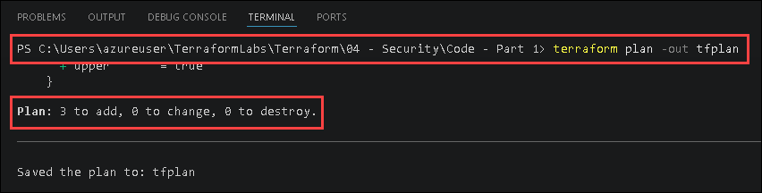

   You should see the following resources listed:
   - `azurerm_key_vault_access_policy.lab04`
   - `azurerm_key_vault_secret.lab04`
   - `random_password.admin_pwd`

1. Apply the Terraform configuration:

   ```bash
   terraform apply tfplan
   ```

   

1. In the [Azure portal](https://portal.azure.com), navigate to your IaC-Terraform-RG-<inject key="Deployment-ID" enableCopy="false"></inject> resource group → **keyvault-<inject key="Deployment-ID" enableCopy="false"></inject>** → **Secrets** → confirm that **lab04admin** has been created.

   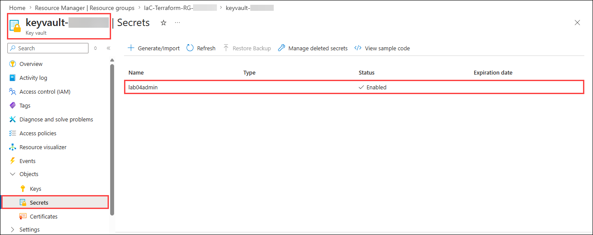

---

## Part 2 — Retrieve the stored secret and use it as the VM administrator password

### Task 4: Retrieve the Key Vault secret inside Terraform

In this task you will modify the VM deployment to retrieve the administrator password directly from Azure Key Vault.

1. In VS Code, open the **Terraform/04 - Security/Code - Part 2** folder in the **TerraformLabs** directory.

   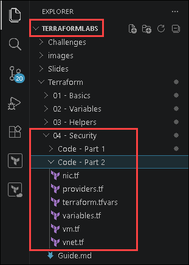

1. Open the `vnet.tf` and update the network configuration:

   ```
   # Virtual Network
   resource "azurerm_virtual_network" "predayvnet" {
     name                = "tfpreday-vnet-<inject key="Deployment-ID"></inject>"
     location            = var.location
     resource_group_name = var.rg
     address_space       = ["10.0.0.0/16"]
     tags                = var.tags
   }

   # Default subnet
   resource "azurerm_subnet" "predaysubnet" {
     name                 = "subnet1"
     resource_group_name  = var.rg
     virtual_network_name = azurerm_virtual_network.predayvnet.name
     address_prefixes     = ["10.0.1.0/24"]
   }

   # Network Security Group with dynamic rules
   resource "azurerm_network_security_group" "predaysg" {
     name                = "default-nsg-<inject key="Deployment-ID"></inject>"
     location            = var.location
     resource_group_name = var.rg

     dynamic "security_rule" {
       for_each = var.security_group_rules

       content {
         name                       = lower(security_rule.value.name)
         description                = "Rule for ${security_rule.value.protocol} traffic"
         priority                   = security_rule.value.priority
         direction                  = security_rule.value.direction
         access                     = security_rule.value.access
         protocol                   = title(security_rule.value.protocol)
         source_port_range          = "*"
         destination_port_range     = security_rule.value.destinationPortRange
         source_address_prefix      = "*"
         destination_address_prefix = "VirtualNetwork"
       }
     }
   }

   # Associate NSG with the default subnet
   resource "azurerm_subnet_network_security_group_association" "preday" {
     subnet_id                 = azurerm_subnet.predaysubnet.id
     network_security_group_id = azurerm_network_security_group.predaysg.id
   }
   ```

   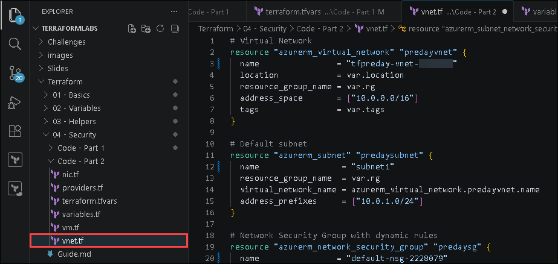

1. Open the `nic.tf` and update the network configuration:

   ```
   # Network Interface
   resource "azurerm_network_interface" "predaynic" {
     name                = "tfpreday-nic-<inject key="Deployment-ID"></inject>"
     location            = var.location
     resource_group_name = var.rg

     ip_configuration {
       name                          = "ipconfig1"
       subnet_id                     = azurerm_subnet.predaysubnet.id
       private_ip_address_allocation = "Dynamic"
     }

     tags = var.tags
   }
   ```

   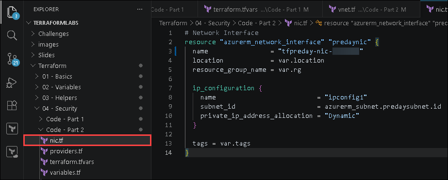

1. Open the `vm.tf` and update the configuration to retrieve the password from Key Vault:

   ```terraform
   # Reference the Key Vault instance from Part 1
   data "azurerm_key_vault" "tf_preday" {
     name                = var.key_vault
     resource_group_name = var.rg2
   }

   # Read the secret stored in Part 1
   data "azurerm_key_vault_secret" "tf_preday" {
     name         = var.secret_id
     key_vault_id = data.azurerm_key_vault.tf_preday.id
   }

   # Linux Virtual Machine — password sourced from Key Vault, never in code
   resource "azurerm_linux_virtual_machine" "predayvm" {
     name                  = "tfpreday-vm-<inject key="Deployment-ID"></inject>"
     location              = var.location
     resource_group_name   = var.rg
     size                  = "Standard_B2s"
     network_interface_ids = [azurerm_network_interface.predaynic.id]

     admin_username                  = "azureadmin"
     disable_password_authentication = false
     admin_password                  = data.azurerm_key_vault_secret.tf_preday.value

     source_image_reference {
       publisher = "Canonical"
       offer     = "0001-com-ubuntu-server-jammy"
       sku       = "22_04-lts-gen2"
       version   = "latest"
     }

     os_disk {
       name                 = "osdisk-tfpreday-<inject key="Deployment-ID"></inject>"
       caching              = "ReadWrite"
       storage_account_type = "Standard_LRS"
     }

     tags = var.tags
   }
   ```

   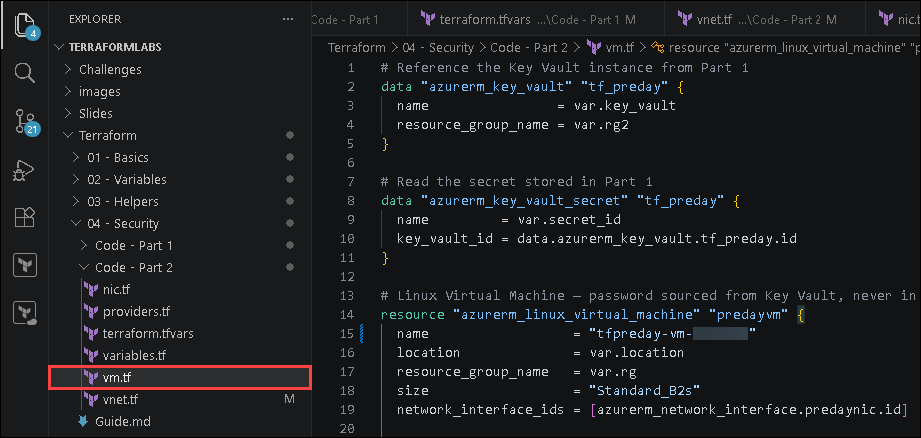

   | Configuration | Description |
   |:--------|:-------------|
   | `data "azurerm_key_vault"` | References the existing Key Vault |
   | `data "azurerm_key_vault_secret"` | Retrieves the stored secret value |
   | `admin_password = data.azurerm_key_vault_secret.tf_preday.value` | Dynamically injects the secret during deployment |

1. Open the `variables.tf` ensure the following variables are present:

   ```terraform
   variable "rg" {
     type        = string
     description = "Name of the resource group to provision resources into."
   }

   variable "location" {
     type        = string
     description = "Azure region where resources will be deployed (e.g. eastus, westeurope)."
   }

   variable "security_group_rules" {
     type = list(object({
       name                 = string
       priority             = number
       protocol             = string
       destinationPortRange = string
       direction            = string
       access               = string
     }))
     description = "List of NSG security rules."
   }

   variable "secret_id" {
     type        = string
     description = "Name of the Key Vault secret containing the VM admin password."
   }

   variable "key_vault" {
     type        = string
     description = "Name of the pre-existing Azure Key Vault instance."
   }

   variable "rg2" {
     type        = string
     description = "Name of the resource group where Key Vault exists."
   }

   variable "tags" {
     type        = map(string)
     description = "Tags to apply to all resources."
   }
   ```

   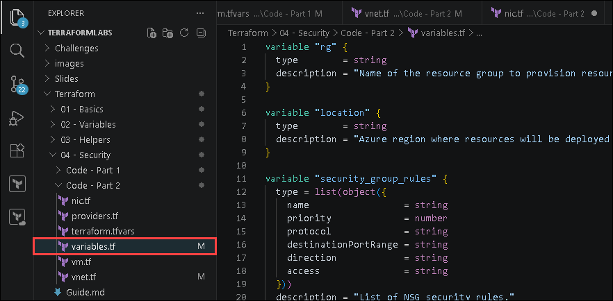

1. Open the `terraform.tfvars` and update the values:

   ```terraform
   rg       = "IaC-Terraform-RG-<inject key="Deployment-ID"></inject>"  # Enter your target resource group name
   location = "<inject key="Region"></inject>"  # Enter your Azure region (e.g. "eastus", "westeurope")

   security_group_rules = [
     {
       name                 = "http"
       priority             = 100
       protocol             = "tcp"
       destinationPortRange = "80"
       direction            = "Inbound"
       access               = "Allow"
     },
     {
       name                 = "https"
       priority             = 150
       protocol             = "tcp"
       destinationPortRange = "443"
       direction            = "Inbound"
       access               = "Allow"
     },
     {
       name                 = "deny-the-rest"
       priority             = 200
       protocol             = "*"
       destinationPortRange = "0-65535"
       direction            = "Inbound"
       access               = "Deny"
     },
   ]

   secret_id = "lab04admin"
   key_vault = "keyvault-<inject key="Deployment-ID"></inject>"  # Enter the pre-created Key Vault name
   rg2       = "IaC-Terraform-RG-<inject key="Deployment-ID"></inject>"  # Enter the resource group where Key Vault exists

   tags = {
     environment = "lab"
     workshop    = "IaC-with-Terraform"
     year        = "2026"
   }
   ```

   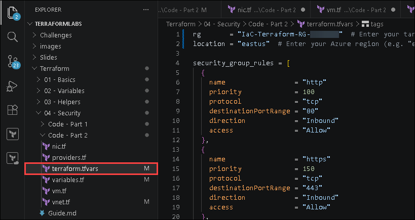

---

### Task 5: Deploy a VM using the secret stored in Key Vault

In this task you will import the existing resources into Terraform state and deploy the updated configuration.

> ⚠️ **Important:** A resource must be present in the Terraform state before Terraform can track, update, or manage it reliably.

1. In the integrated terminal, navigate to the `C:\Users\azureuser\TerraformLabs\Terraform\04 - Security\Code - Part 2` directory:

   ```
   cd 'C:\Users\azureuser\TerraformLabs\Terraform\04 - Security\Code - Part 2'
   ```

1. Initialize the Terraform working directory:

   ```bash
   terraform init
   ```

   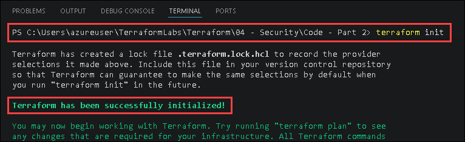

   You should see: `Terraform has been successfully initialized!`

1. Import the existing Virtual Machine resource into Terraform state:

   ```
   terraform import azurerm_linux_virtual_machine.predayvm "/subscriptions/<inject key="AzureSubscriptionID"></inject>/resourceGroups/IaC-Terraform-RG-<inject key="Deployment-ID"></inject>/providers/Microsoft.Compute/virtualMachines/tfpreday-vm-<inject key="Deployment-ID"></inject>"
   ```

   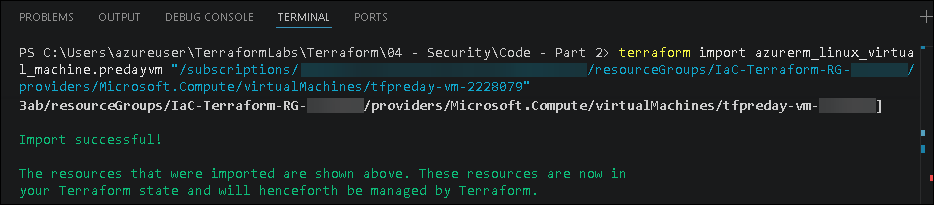

1. Import the existing Network Interface resource into Terraform state:

   ```
   terraform import azurerm_network_interface.predaynic "/subscriptions/<inject key="AzureSubscriptionID"></inject>/resourceGroups/IaC-Terraform-RG-<inject key="Deployment-ID"></inject>/providers/Microsoft.Network/networkInterfaces/tfpreday-nic-<inject key="Deployment-ID"></inject>"
   ```

   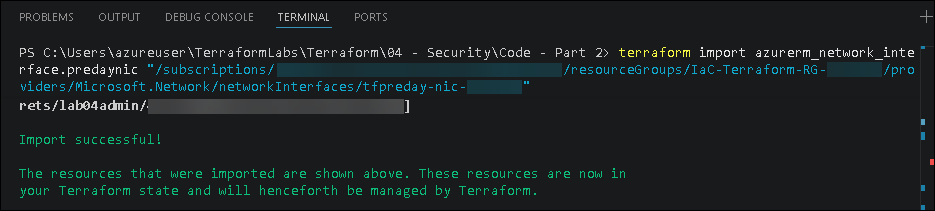

1. Import the existing Virtual Network resource into Terraform state:

   ```
   terraform import azurerm_virtual_network.predayvnet "/subscriptions/<inject key="AzureSubscriptionID"></inject>/resourceGroups/IaC-Terraform-RG-<inject key="Deployment-ID"></inject>/providers/Microsoft.Network/virtualNetworks/tfpreday-vnet-<inject key="Deployment-ID"></inject>"
   ```

   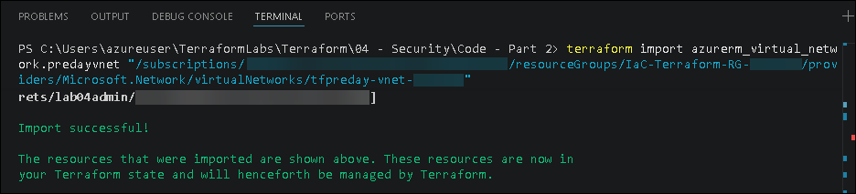

1. Import the existing subnet resource into Terraform state:

   ```
   terraform import azurerm_subnet.predaysubnet "/subscriptions/<inject key="AzureSubscriptionID"></inject>/resourceGroups/IaC-Terraform-RG-<inject key="Deployment-ID"></inject>/providers/Microsoft.Network/virtualNetworks/tfpreday-vnet-<inject key="Deployment-ID"></inject>/subnets/subnet1"
   ```

   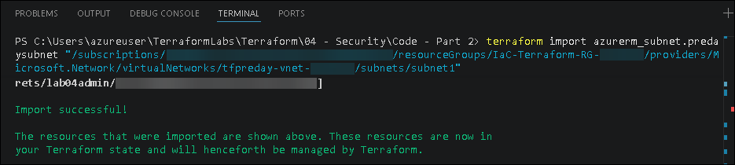

1. Generate an execution plan:

   ```bash
   terraform plan -out tfplan
   ```

   Expected output:

   ```
   Plan: 2 to add, 3 to change, 0 to destroy.
   ```

   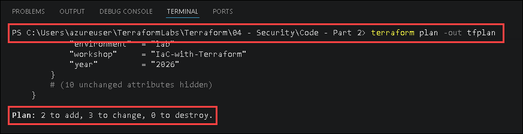

   You should see `azurerm_network_security_group` and `azurerm_subnet_network_security_group_association` created and your Virtual Machine's password updated to the Azure Key Vault's secret.

1. Apply the Terraform configuration:

   ```bash
   terraform apply tfplan
   ```

   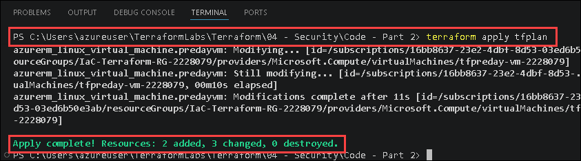

1. In the [Azure portal](https://portal.azure.com), navigate to your IaC-Terraform-RG-<inject key="Deployment-ID" enableCopy="false"></inject> resource group and verify that the **default-nsg-<inject key="Deployment-ID" enableCopy="false"></inject>** Network Security Group is created and is associated to the **subnet1**.

   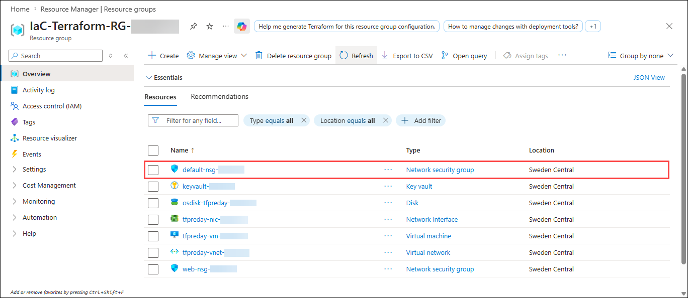

   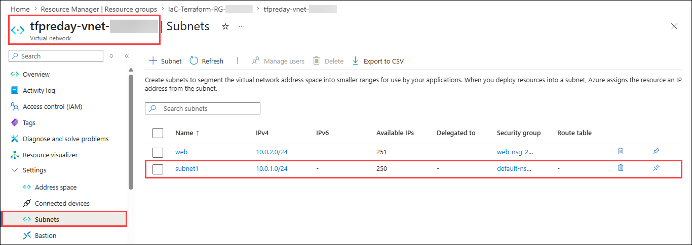

---

## 🧾 Summary

In this lab, you completed the following:

- Configured Terraform providers for Azure, Azure AD, and Key Vault integration
- Generated a secure random password dynamically using Terraform
- Stored the generated password securely in Azure Key Vault
- Initialized and deployed the Key Vault secret configuration using Terraform
- Retrieved the Key Vault secret using Terraform data sources
- Deployed a Virtual Machine using the secret stored in Azure Key Vault
- Eliminated hard-coded passwords from Terraform configuration files

---

You have successfully completed the lab. Click **Next >>** in the lower-right corner to proceed to the next lab.


