# Lab 05: Reusability — Terraform Modules

### Estimated Duration: 60 Minutes

## Overview

In this lab, you will refactor the infrastructure created in previous labs into a reusable Terraform module. Terraform modules allow you to package related resources into reusable components that can be deployed multiple times using different input values.

You will create a reusable module named `azvm` that provisions:

- A subnet
- A Network Security Group (NSG)
- An NSG association
- A Network Interface (NIC)
- A Linux Virtual Machine

You will then call the module twice from the root configuration to deploy:

- A frontend web tier
- A database tier

## Lab Objectives

You will be able to complete the following tasks:

- Task 1: Prepare the Terraform module structure
- Task 2: Build the reusable module components
- Task 3: Deploy multiple environments using the module
- Task 4: Deploy Infrastructure Using the Terraform Module

---

## Task 1: Prepare the Terraform module structure

In this task, you will review the folder structure used for Terraform modules and understand how Terraform organizes reusable infrastructure components.

**Why modules matter**

Without modules, infrastructure definitions become repetitive very quickly. For example, deploying multiple virtual machines would require duplicating:

- NIC configuration
- NSG configuration
- VM configuration
- Subnet configuration

Modules solve this by allowing you to define infrastructure once and reuse it multiple times with different inputs.

1. In VS Code, open the **Terraform/05 - Reusability/Code** folder in the **TerraformLabs** directory.

   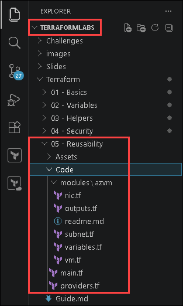

   ```
   Terraform/05 - Reusability/Code/
   ├── main.tf
   ├── providers.tf
   └── modules/
       └── azvm/
           ├── variables.tf
           ├── outputs.tf
           ├── subnet.tf
           ├── nic.tf
           ├── vm.tf
           └── readme.md
   ```

   | File | Purpose |
   |:-----|:--------|
   | `main.tf` | Root configuration that calls the reusable module |
   | `providers.tf` | Defines Terraform and AzureRM provider requirements |
   | `modules/azvm/variables.tf` | Input variables accepted by the module |
   | `modules/azvm/subnet.tf` | Creates subnet, NSG, and NSG association |
   | `modules/azvm/nic.tf` | Creates the network interface |
   | `modules/azvm/vm.tf` | Creates the Linux virtual machine |
   | `modules/azvm/outputs.tf` | Returns useful values back to the root configuration |

   > **Note:** Terraform modules use the same HCL syntax as root configurations. The `variables.tf` file defines the public interface of the module.

---

## Task 2: Build the reusable module components

1. Open the `providers.tf` file and review the configuration:

   ```terraform
   terraform {
     required_providers {
       azurerm = {
         source  = "hashicorp/azurerm"
         version = "~> 4.0"
       }
     }
     required_version = ">= 1.9.0"
   }

   provider "azurerm" {
     features {}

     resource_provider_registrations = "none"
   }
   ```

   

1. Open the `modules/azvm/variables.tf` file and review the configuration:

   ```terraform
   variable "rg" {
     type        = string
     description = "Name of the resource group to provision resources into."
   }

   variable "location" {
     type        = string
     description = "Azure region where resources will be deployed."
   }

   variable "security_group_rules" {
     type = list(object({
       name                 = string
       priority             = number
       protocol             = string
       destinationPortRange = string
       direction            = string
       access               = string
     }))
     description = "List of NSG security rules."
   }

   variable "secret_id" {
     type        = string
     description = "Name of the Key Vault secret containing the VM admin password."
   }

   variable "key_vault" {
     type        = string
     description = "Name of the pre-existing Azure Key Vault instance."
   }

   variable "rg2" {
     type        = string
     description = "Name of the resource group where Key Vault exists."
   }

   variable "tags" {
     type        = map(string)
     description = "Tags to apply to all resources."
   }

   variable "vnet_name" {
     type        = string
     description = "Name of the Virtual Network where subnets will be placed."
   }

   variable "subnet_cidr" {
     type        = string
     description = "Subnet address prefix in CIDR notation (e.g. 172.16.10.0/24)."
   }

   variable "host_name" {
     type        = string
     description = "Unique hostname for the virtual machine. Also used to derive the subnet name."
   }
   ```

   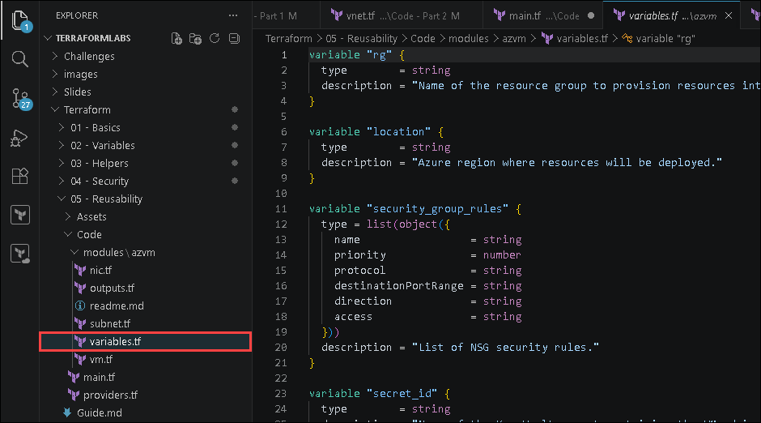

   | Variable | Purpose |
   |:---------|:--------|
   | `host_name` | Defines the VM hostname |
   | `subnet_cidr` | Defines the subnet address range |
   | `vnet_name` | Specifies the target Virtual Network |
   | `security_group_rules` | Defines NSG rules dynamically |
   | `secret_id` | Specifies the Key Vault secret name |
   | `tags` | Applies tags across all resources |

1. Open the `modules/azvm/subnet.tf` file and review the configuration:

   ```terraform
   # Subnet — name is derived from the host_name prefix using the regex() function
   resource "azurerm_subnet" "predaysubnet" {
     name                 = regex("^[[:alpha:]]+", var.host_name)
     resource_group_name  = var.rg
     virtual_network_name = var.vnet_name
     address_prefixes     = [var.subnet_cidr]
   }

   # NSG with dynamic rules
   resource "azurerm_network_security_group" "predaysg" {
     name                = "nsg-${var.host_name}"
     location            = var.location
     resource_group_name = var.rg

     dynamic "security_rule" {
       for_each = var.security_group_rules

       content {
         name                       = lower(security_rule.value.name)
         description                = "Rule for ${security_rule.value.protocol} traffic"
         priority                   = security_rule.value.priority
         direction                  = security_rule.value.direction
         access                     = security_rule.value.access
         protocol                   = title(security_rule.value.protocol)
         source_port_range          = "*"
         destination_port_range     = security_rule.value.destinationPortRange
         source_address_prefix      = "*"
         destination_address_prefix = "VirtualNetwork"
       }
     }
   }

   # Associate NSG with subnet
   resource "azurerm_subnet_network_security_group_association" "preday" {
     subnet_id                 = azurerm_subnet.predaysubnet.id
     network_security_group_id = azurerm_network_security_group.predaysg.id
   }
   ```

   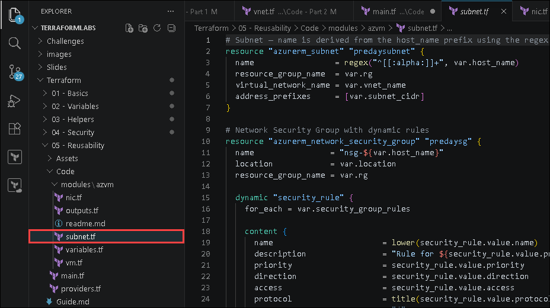

   | Configuration | Purpose |
   |:---------|:--------|
   | `regex()` | Extracts the subnet name prefix from the hostname |
   | `dynamic "security_rule"` | Generates NSG rules dynamically |
   | `for_each` | Iterates through the rule collection |
   | `lower()` | Converts rule names to lowercase |
   | `title()` | Capitalizes protocol values |

   > **Note:** For `web001`, the `regex()` function returns `web`. For `mysql001`, it returns `mysql`.
   
1. Open the `modules/azvm/nic.tf` file and review the configuration:

   ```terraform
   resource "azurerm_network_interface" "predaynic" {
     name                = "nic-${var.host_name}"
     location            = var.location
     resource_group_name = var.rg

     ip_configuration {
       name                          = "ipconfig1"
       subnet_id                     = azurerm_subnet.predaysubnet.id
       private_ip_address_allocation = "Dynamic"
     }

     tags = var.tags
   }
   ```

   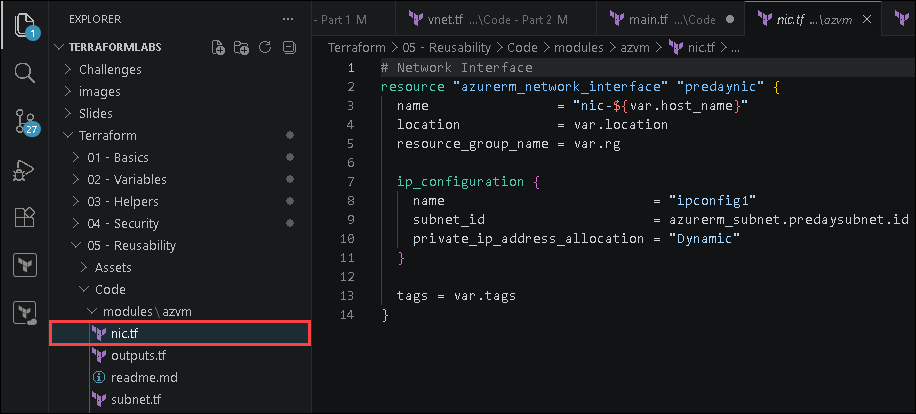

   | Configuration | Purpose |
   |:---------|:--------|
   | `subnet_id` | Associates the NIC with the subnet |
   | `private_ip_address_allocation` | Assigns a dynamic private IP address |
   | `tags` | Applies resource tags |

1. Open the modules/azvm/vm.tf file and review the configuration:

   ```terraform
   # Reference the Key Vault instance
   data "azurerm_key_vault" "azvm" {
     name                = var.key_vault
     resource_group_name = var.rg2
   }

   # Read the admin password secret
   data "azurerm_key_vault_secret" "azvm" {
     name         = var.secret_id
     key_vault_id = data.azurerm_key_vault.azvm.id
   }

   # Linux Virtual Machine
   resource "azurerm_linux_virtual_machine" "predayvm" {
     name                  = var.host_name
     location              = var.location
     resource_group_name   = var.rg
     size                  = "Standard_B2s"
     network_interface_ids = [azurerm_network_interface.predaynic.id]

     admin_username                  = "azureadmin"
     disable_password_authentication = false
     admin_password                  = data.azurerm_key_vault_secret.azvm.value

     source_image_reference {
       publisher = "Canonical"
       offer     = "0001-com-ubuntu-server-jammy"
       sku       = "22_04-lts-gen2"
       version   = "latest"
     }

     os_disk {
       name                 = "osdisk-${var.host_name}"
       caching              = "ReadWrite"
       storage_account_type = "Standard_LRS"
     }

     tags = var.tags
   }
   ```

   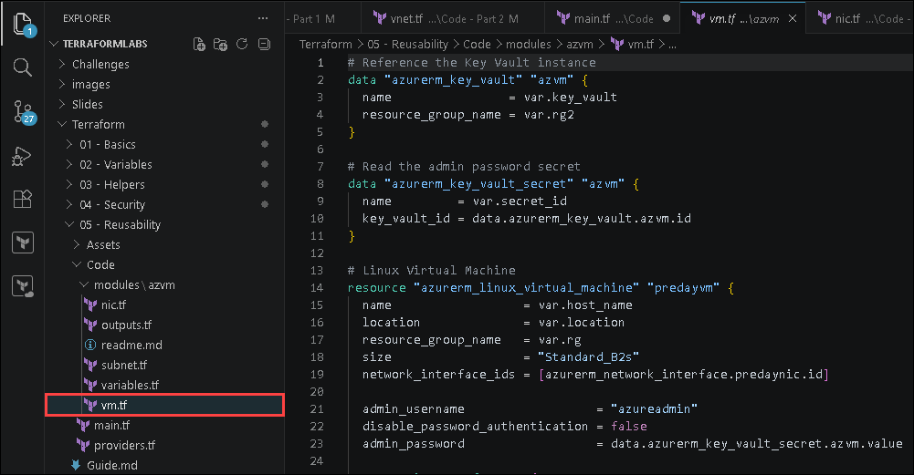

   | Configuration | Purpose |
   |:---------|:--------|
   | `data "azurerm_key_vault"` | References the existing Key Vault |
   | `data "azurerm_key_vault_secret"` | Retrieves the VM password secret |
   | `network_interface_ids` | Attaches the NIC to the VM |
   | `admin_password` | Uses the Key Vault secret value securely |

1. Open the modules/azvm/outputs.tf file and review the configuration:

   ```terraform
   output "vm_id" {
     value       = azurerm_linux_virtual_machine.predayvm.id
     description = "The Azure resource ID of the virtual machine."
   }

   output "private_ip" {
     value       = azurerm_network_interface.predaynic.private_ip_address
     description = "The private IP address assigned to the NIC."
   }

   output "mac_address" {
     value       = azurerm_network_interface.predaynic.mac_address
     description = "The MAC address of the NIC."
   }
   ```

   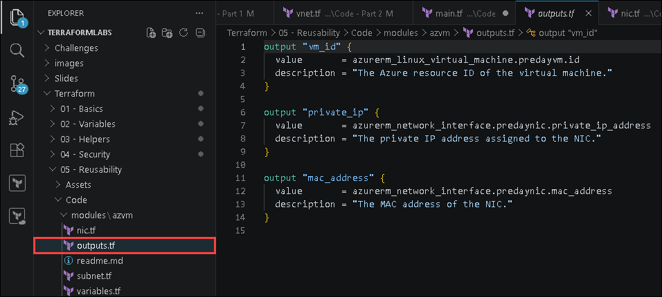

   | Output | Purpose |
   |:---------|:--------|
   | `vm_id` | Returns the VM resource ID. |
   | `private_ip` | Returns the NIC private IP address. |
   | `mac_address` | Returns the NIC MAC address. |

---

## Deploy multiple environments using the module

In this task, you will call the same module twice to deploy two independent infrastructure tiers.

1. Open the `main.tf` and update the configuration:

   ```terraform
   locals {
     rg       = "IaC-Terraform-RG-<inject key="Deployment-ID"></inject>"  # Enter your target resource group name
     location = "<inject key="Region"></inject>"  # Enter your Azure region (e.g. "eastus", "westeurope")

     rg2       = "IaC-Terraform-RG-<inject key="Deployment-ID"></inject>"  # Enter the resource group where Key Vault exists
     key_vault = "keyvault-<inject key="Deployment-ID"></inject>"  # Enter the pre-created Key Vault name

     tags = {
       environment = "lab"
       workshop    = "IaC-with-Terraform"
       year        = "2026"
     }
   }

   # Shared Virtual Network — modules attach their subnets to this VNet
   resource "azurerm_virtual_network" "predayvnet" {
     name                = "tf-reusable-vnet-<inject key="Deployment-ID"></inject>"
     location            = local.location
     resource_group_name = local.rg
     address_space       = ["172.16.0.0/16"]
     tags                = local.tags
   }

   # Frontend (web) tier VM
   module "frontend" {
     source = "./modules/azvm"

     host_name   = "web001"
     rg          = local.rg
     location    = local.location
     rg2         = local.rg2
     secret_id   = "lab04admin"
     key_vault   = local.key_vault
     vnet_name   = azurerm_virtual_network.predayvnet.name
     subnet_cidr = "172.16.10.0/24"

     security_group_rules = [
       {
         name                 = "http"
         priority             = 100
         protocol             = "tcp"
         destinationPortRange = "80"
         direction            = "Inbound"
         access               = "Allow"
       },
       {
         name                 = "https"
         priority             = 150
         protocol             = "tcp"
         destinationPortRange = "443"
         direction            = "Inbound"
         access               = "Allow"
       },
       {
         name                 = "deny-the-rest"
         priority             = 200
         protocol             = "*"
         destinationPortRange = "0-65535"
         direction            = "Inbound"
         access               = "Deny"
       },
     ]

     tags = local.tags
   }

   # Database tier VM
   module "mysql_db" {
     source = "./modules/azvm"

     host_name   = "mysql001"
     rg          = local.rg
     location    = local.location
     rg2         = local.rg2
     secret_id   = "lab04admin"
     key_vault   = local.key_vault
     vnet_name   = azurerm_virtual_network.predayvnet.name
     subnet_cidr = "172.16.20.0/24"

     security_group_rules = [
       {
         name                 = "mysql"
         priority             = 100
         protocol             = "tcp"
         destinationPortRange = "3306"
         direction            = "Inbound"
         access               = "Allow"
       },
       {
         name                 = "deny-the-rest"
         priority             = 200
         protocol             = "*"
         destinationPortRange = "0-65535"
         direction            = "Inbound"
         access               = "Deny"
       },
     ]

     tags = local.tags
   }
   ```

   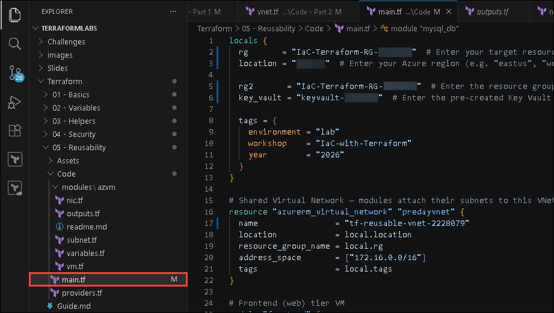

   | Module | Purpose |
   |:---------|:--------|
   | `frontend` | Deploys the frontend web tier resources |
   | `mysql_db` | Deploys the database tier resources |
   | `source` | Specifies the module location |
   | `subnet_cidr` | Assigns a unique subnet range per module instance |

   > **Note:** Each module instance provisions an independent set of resources using the same reusable module code.

   > **Note:** You can also reference module outputs in root configuration. For example:

     ```terraform
     output "frontend_ip" {
       value = module.frontend.private_ip
     }
     ```

---

## Task 4: Deploy Infrastructure Using the Terraform Module

In this task, you will deploy the reusable infrastructure using Terraform modules.

1. In the integrated terminal, navigate to the `C:\Users\azureuser\TerraformLabs\Terraform\03 - Helpers\code` directory:

   ```
   cd 'C:\Users\azureuser\TerraformLabs\Terraform\05 - Reusability\Code'
   ```
   
1. Initialize the Terraform working directory:

   ```bash
   terraform init
   ```

   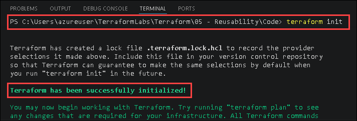

   You should see: `Terraform has been successfully initialized!`

1. Generate an execution plan:

   ```bash
   terraform plan -out tfplan
   ```

   Expected output:

   ```
   Plan: 11 to add, 0 to change, 0 to destroy.
   ```

   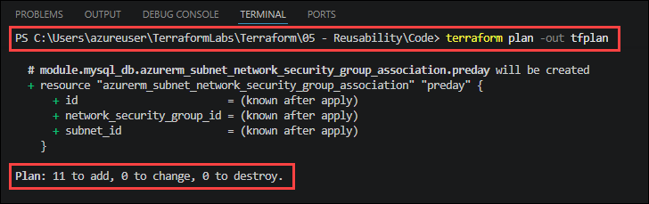

   Resources: 1 VNet + (2 subnets + 2 NSGs + 2 NSG associations + 2 NICs + 2 VMs) = 11.

1. Deploy the infrastructure:

   ```bash
   terraform apply tfplan
   ```

   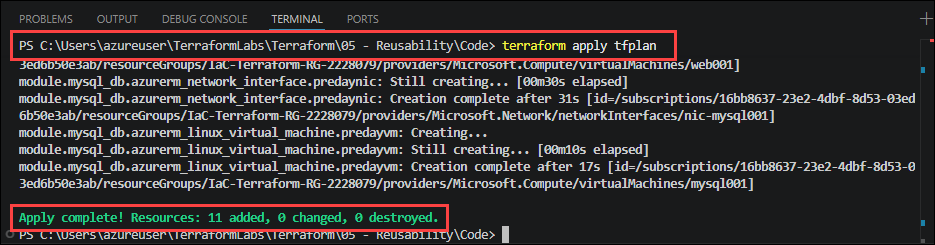

1. In the [Azure portal](https://portal.azure.com), navigate to your **IaC-Terraform-RG-<inject key="Deployment-ID"></inject>** resource group and verify that the following resources are created:
   
   - VNet **tf-reusable-vnet** with two subnets: **web** (`172.16.10.0/24`) and **mysql** (`172.16.20.0/24`).
   - Two NSGs: **nsg-web001** (HTTP/HTTPS rules) and **nsg-mysql001** (MySQL rule).
   - Two VMs: **web001** and **mysql001**.
  
   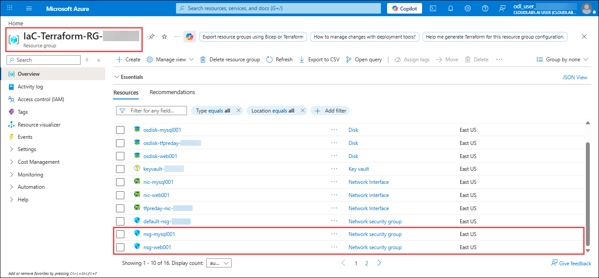

   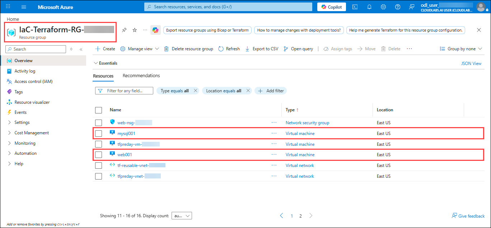

   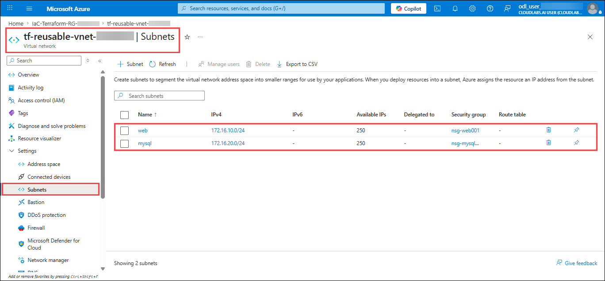

---

## Summary

In this lab, you completed the following:

- Prepared and organized a reusable Terraform module structure
- Built reusable module components for subnet, NSG, NIC, and Virtual Machine resources
- Used module input variables and outputs to customize and manage deployments
- Retrieved Virtual Machine passwords securely from Azure Key Vault
- Used dynamic blocks, iteration, and helper functions inside Terraform modules
- Deployed multiple infrastructure environments using a single reusable module
- Reduced code duplication and improved infrastructure maintainability
- Deployed infrastructure using the Terraform module workflow

### You have successfully completed all five Terraform labs!

In this workshop, you used Terraform to provision and manage Azure infrastructure using Infrastructure as Code (IaC) principles. You deployed Virtual Networks, Subnets, Network Interfaces, Network Security Groups, and Linux Virtual Machines while learning Terraform workflows, variables, helper functions, dynamic blocks, and resource dependencies.

You also implemented secure secrets management using Azure Key Vault, generated reusable infrastructure using Terraform modules, and deployed multiple infrastructure tiers from a single reusable module source. Throughout the labs, you applied Terraform best practices for automation, modularity, scalability, security, and maintainability on Microsoft Azure.
