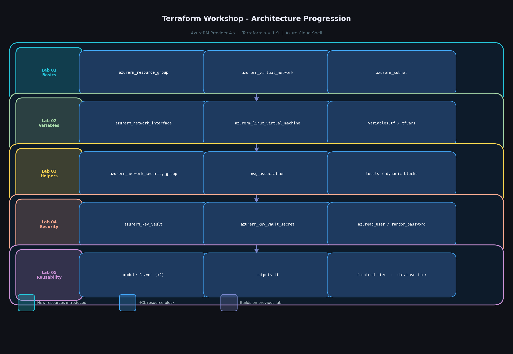
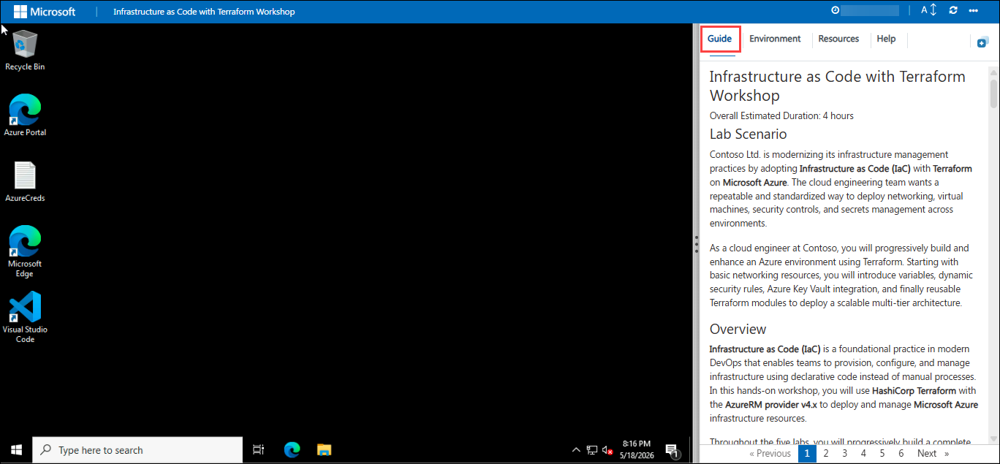
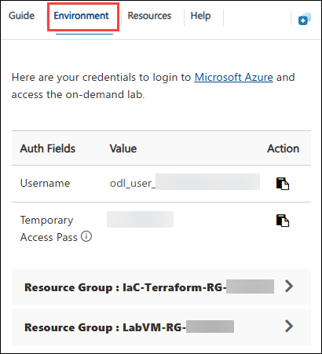
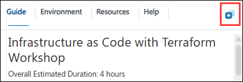
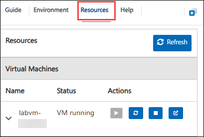
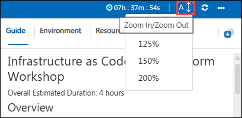
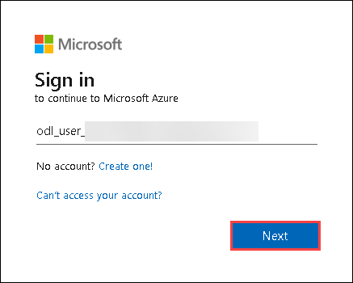
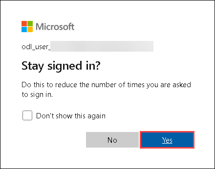

# Infrastructure as Code with Terraform Workshop

#### Overall Estimated Duration: 4 hours

## Lab Scenario

Contoso Ltd. is modernizing its infrastructure management practices by adopting **Infrastructure as Code (IaC)** with **Terraform** on **Microsoft Azure**. The cloud engineering team wants a repeatable and standardized way to deploy networking, virtual machines, security controls, and secrets management across environments.

As a cloud engineer at Contoso, you will progressively build and enhance an Azure environment using Terraform. Starting with basic networking resources, you will introduce variables, dynamic security rules, Azure Key Vault integration, and finally reusable Terraform modules to deploy a scalable multi-tier architecture.

## Overview

**Infrastructure as Code (IaC)** is a foundational practice in modern DevOps that enables teams to provision, configure, and manage infrastructure using declarative code instead of manual processes. In this hands-on workshop, you will use **HashiCorp Terraform** with the **AzureRM provider v4.x** to deploy and manage **Microsoft Azure** infrastructure resources.

Throughout the five labs, you will progressively build a complete Terraform-based Azure environment, starting with a basic Virtual Network and Subnet, then extending the deployment with Virtual Machines, Network Security Groups (NSGs), dynamic configurations, Azure Key Vault integration, and reusable Terraform modules.

You will learn how Terraform uses **HashiCorp Configuration Language (HCL)** to define infrastructure, how to parameterize deployments using variables, how Terraform automatically builds resource dependency graphs, and how reusable modules simplify large-scale infrastructure deployments.

By the end of this workshop, you will be able to write, validate, and deploy modular Terraform configurations that follow modern Infrastructure as Code best practices on Azure.

## Objectives

By the end of this hands-on workshop, you will be able to:

- Use Terraform with Microsoft Azure.
- Understand the Terraform workflow: init, plan, and apply.
- Provision Azure networking and Virtual Machine resources using Terraform.
- Use variables and terraform.tfvars for parameterized deployments.
- Create dynamic NSG rules using Terraform iterators and helper functions.
- Secure secrets using Azure Key Vault.
- Build reusable Terraform modules for scalable deployments.
- Deploy multiple infrastructure tiers from a single module source.

## Prerequisites

**IMPORTANT:** All required tools, Terraform binaries, VS Code extensions, and lab files are already pre-installed and configured on the Lab-VM. **No additional setup is required.**

Before you begin, ensure you have:

- An active **Microsoft Azure subscription** to deploy and manage Azure resources.
- An **Azure Entra ID user account** with sufficient permissions to create and manage resources within the Azure subscription.
- A pre-created **Azure Key Vault** configured with the **Vault access policy permission model**, as Azure Key Vault supports either Azure role-based access control (RBAC) or Vault access policy at a time.

In addition, you will need the following tools installed on your local machine/Lab-VM:

- **Visual Studio Code** - Used as the primary editor to write, manage, and execute Terraform configurations.
- **Terraform** - Used to provision and manage Azure infrastructure through Infrastructure as Code (IaC).
- **Azure CLI** - Used to authenticate to Azure and interact with Azure resources from the terminal.
- **HashiCorp Terraform VS Code Extension** - Provides Terraform language support in VS Code, including syntax highlighting, validation, and IntelliSense.

## Architechture

In this workshop, Terraform is used to provision and manage Azure infrastructure using reusable and modular configurations.

You will deploy Azure resources such as:

- Virtual Networks and Subnets
- Network Security Groups (NSGs)
- Network Interfaces (NICs)
- Linux Virtual Machines
- Azure Key Vault secrets

In the final lab, you will refactor the infrastructure into reusable Terraform modules to deploy multiple infrastructure tiers from a single code base.

## Architechture Diagram

## Explanation of Components

- **Terraform CLI** – Used to initialize, plan, and deploy Azure infrastructure.
- **AzureRM Provider** – Terraform provider used to manage Azure resources.
- **Visual Studio Code** – Used to create and manage Terraform configuration files.
- **Azure CLI** – Used to authenticate and interact with Azure.
- **Azure Virtual Network (VNet)** – Provides private networking for Azure resources.
- **Azure Subnet** – Logical network segment inside a VNet.
- **Azure Network Security Group (NSG)** – Controls inbound and outbound network traffic.
- **Azure Network Interface (NIC)** – Connects Virtual Machines to the network.
- **Azure Linux Virtual Machine** – Compute resource deployed using Terraform.
- **Azure Key Vault** – Securely stores passwords and secrets.
- **Terraform Variables** – Used to parameterize infrastructure configurations.
- **Terraform Modules** – Reusable Terraform configurations used for scalable deployments.

## Getting Started with Lab

Welcome to your Infrastructure as Code with Terraform Workshop! We've prepared a seamless environment for you to migrate and modernize the iconic Spring Boot PetClinic application from local execution to Azure Kubernetes Service (AKS). You'll experience the complete modernization journey using AI-powered tools such as GitHub Copilot app modernization and Containerization Assist MCP Server. Let's begin by making the most of this experience.

### Accessing Your Lab Environment

Once you're ready to dive in, your virtual machine and lab guide will be right at your fingertips within your web browser.

### Virtual Machine & Lab Guide

Your virtual machine is your workhorse throughout the workshop. The lab **Guide** is your roadmap to success.

### Exploring Your Lab Resources

To get a better understanding of your lab resources and credentials, navigate to the **Environment** tab.

### Utilizing the Split Window Feature

For convenience, you can open the lab guide in a separate window by selecting the **Split Window** button from the Top right corner.

### Managing Your Virtual Machine

Feel free to **Start, Restart, or Stop** your virtual machine as needed from the **Resources** tab. Your experience is in your hands!

### Lab Guide Zoom In/Zoom Out

To adjust the zoom level for the environment page, click the **A↕: 100%** icon located next to the timer in the lab environment.

## Login to Azure portal

1. On your virtual machine, click on the **Azure Portal** icon as shown below:

   

1. On the Sign in to Microsoft Azure tab you will see the login screen, in that enter the following email/username and click **Next**.

   - **Email/Username:** <inject key="AzureAdUserEmail"></inject>

     

1. Now enter the following password and click **Sign in**.

   - **Temporary Access Pass:** <inject key="AzureAdUserPassword"></inject>

     

1. If you see the pop-up **Stay Signed in?**, click **Yes**.

   

1. If a Welcome to Microsoft Azure pop-up window appears, simply click **Maybe later** to skip the tour.

1. Use the **IaC-Terraform-RG-<inject key="Deployment-ID" enableCopy="false"/></inject>** resource group for all Azure resources provisioned during the labs.

## Support Contact

The CloudLabs support team is available 24/7, 365 days a year, via email and live chat to ensure seamless assistance at any time. We offer dedicated support channels tailored specifically for both learners and instructors, ensuring that all your needs are promptly and efficiently addressed.

Learner Support Contacts:

- Email Support: cloudlabs-support@spektrasystems.com
- Live Chat Support: https://cloudlabs.ai/labs-support

Now, click **Next** from the lower right corner to move on to the next page.

### Happy Learning!!
